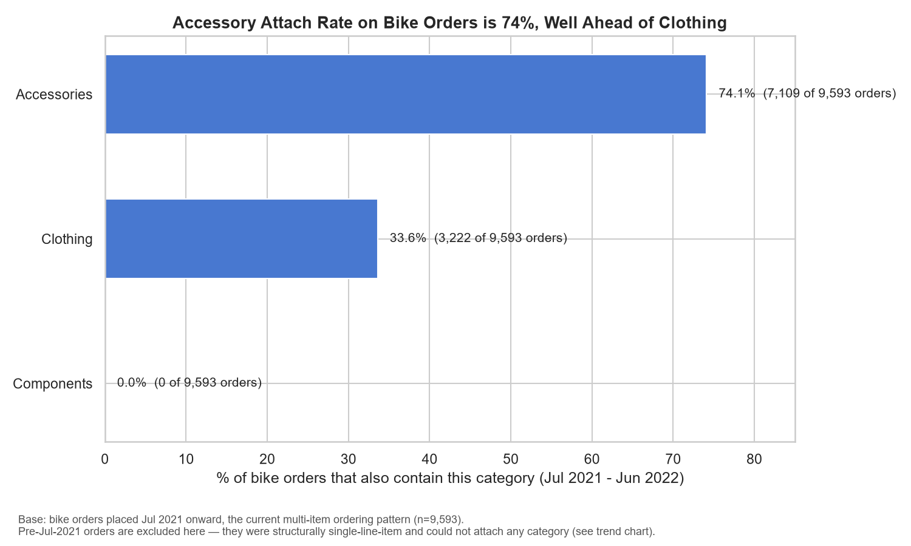
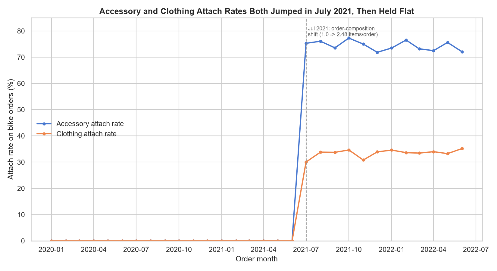
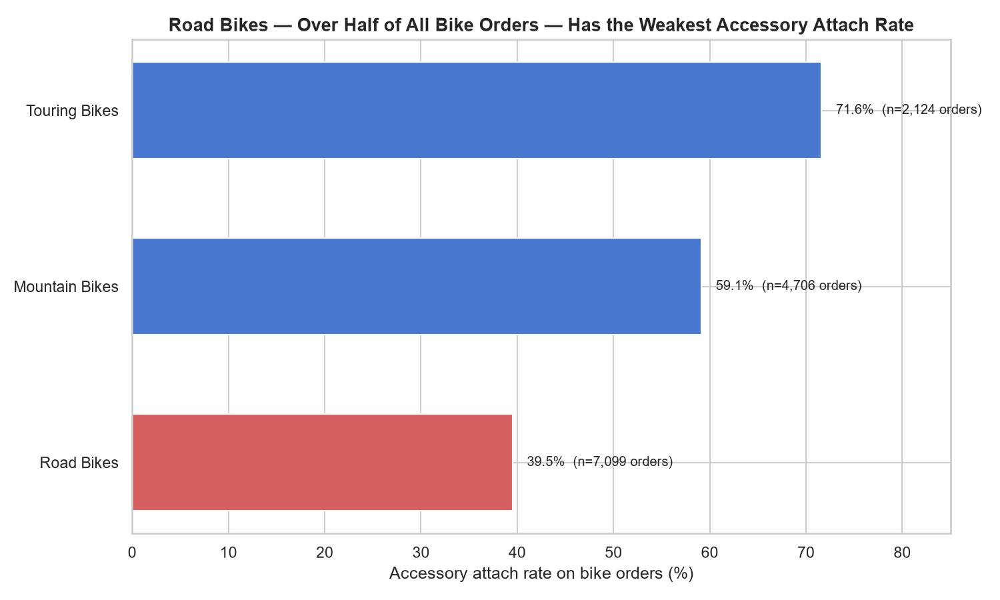
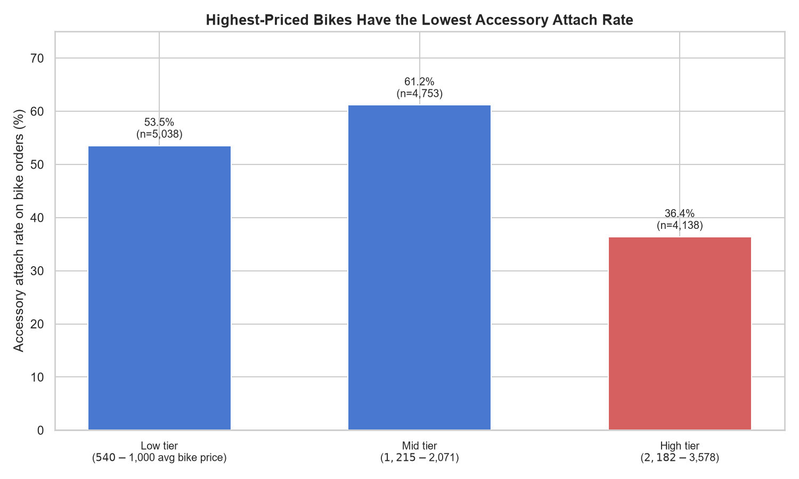
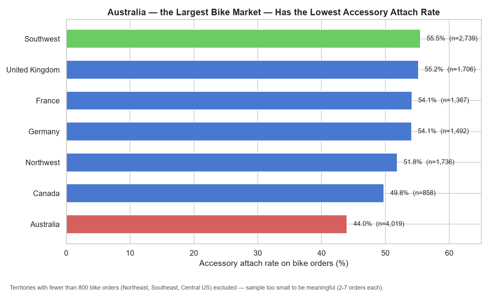
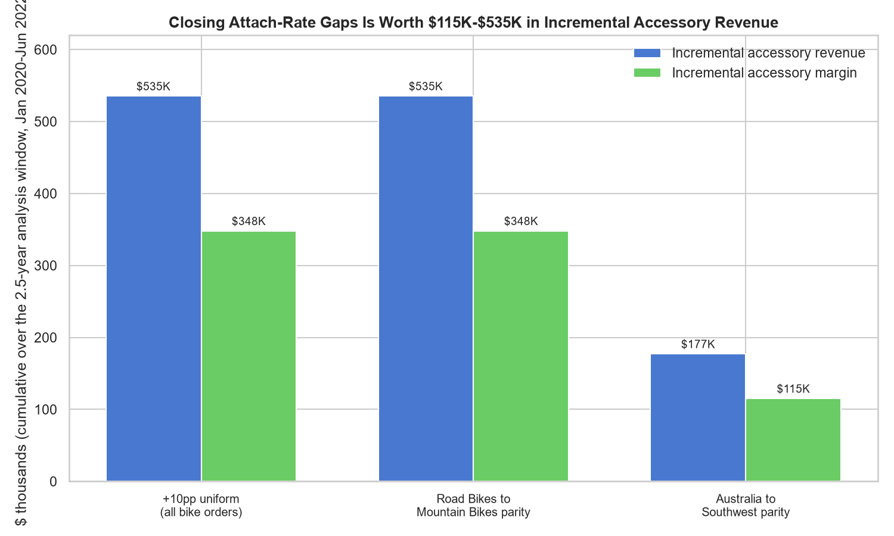

# Insight Report: Bike-to-Accessory Attach Rate

**Date:** 2026-08-02
**Database used:** ADVENTURE_WORKS.DATA (Snowflake, warehouse COMPUTE_WH)
**Based on:** `insights_sales_performance.md`, `quality_adventure_works.md`, `eda_adventure_works.md` (2026-07-22), and `cleaned_fact_sales.csv` / `cleaned_fact_sales_log.md`

## Executive Summary

**Yes — Adventure Works should invest in growing accessory attach-rate, but as a targeted fix, not a broad-based program.** Under the current ordering pattern (orders placed July 2021 onward, the only period in which a customer could physically buy more than one category in a single order), **74.1% of bike orders already include an accessory** (7,109 of 9,593 orders) — a healthy, high-margin habit (accessory category margin is 61.3%) that is already largely established. The opportunity is not "attach rate is broken everywhere"; it is that three specific, high-volume segments lag well behind the rest of the book: **Road Bikes** (39.5% attach vs. 71.6% for Touring Bikes), **Australia** (44.0% attach vs. 55.5% for Southwest US, the next-largest territory), and **high-priced bikes** (36.4% attach vs. 61.2% for mid-tier bikes). Closing just the Road Bikes gap to Mountain Bikes' level would generate an estimated **+$535K in incremental accessory revenue and +$348K in incremental margin** over the 2.5-year analysis window (~$140K/year margin). Recommended action: checkout-stage accessory prompts targeted at Road Bikes and high-tier bike purchases, plus a territory-specific push in Australia — not a blanket attach-rate campaign.

## Key Findings

1. **Whole-history attach rate is 51.0%** (7,109 of 13,929 bike orders also contain an accessory), but this figure is distorted by a known structural fact: **every order placed before July 2021 was a single-line-item order** (see `insights_sales_performance.md`), so those 4,336 bike orders could not have attached anything by construction. The decision-relevant number is the **current-pattern rate of 74.1%** (7,109 of 9,593 bike orders placed July 2021 onward).
2. **The July 2021 jump was not accessory-specific — it lifted every attach category at once.** Accessory attach rate went from 0% to ~74% and clothing attach rate went from 0% to ~34% in the same month, moving together. This confirms the sales-performance report's caution: the shift is a structural change in order capture (single-item → multi-item baskets), not a targeted accessory-attach initiative or a specific customer behavior change — see Risks.
3. **Since July 2021, accessory attach rate has been flat**, oscillating narrowly between 71.9% and 77.3% month to month with no upward or downward trend — there is no organic momentum to rely on; any improvement requires a deliberate intervention.
4. **Road Bikes — the single largest bike subcategory (7,099 of 13,929 bike orders, 51%) — has by far the weakest attach rate: 39.5%**, compared to 59.1% for Mountain Bikes and 71.6% for Touring Bikes. Because of its sheer volume, Road Bikes alone accounts for most of the total attach-rate shortfall.
5. **High-priced bikes attach accessories least often.** Bikes in the top price tier ($2,182–$3,578 average order price) attach at 36.4%, versus 61.2% for mid-tier bikes ($1,215–$2,071) and 53.5% for low-tier bikes ($540–$1,000). Premium bike buyers — the highest-wallet-share customers — are the least likely to leave with an accessory.
6. **Australia, the largest single bike market (4,019 of 13,929 bike orders, 29%), has the lowest territory attach rate among high-volume markets: 44.0%**, versus 55.5% for Southwest US (the next-largest market) and 51–55% for the UK, France, Germany, and Northwest US.
7. **Accessories are a genuine profit center, not just a volume filler.** Accessory category margin is 61.3% (vs. Bikes' ~40% typical margin per the cost/price data), and the average bike order that already includes an accessory adds $384 in accessory revenue and $250 in accessory margin. 58.1% of all accessory orders (9,874 of 16,983) are standalone — bought with no bike in the same order — confirming accessories also drive independent traffic; growing bike attach rate is additive to that channel, not cannibalistic.
8. **Quantified opportunity: $115K–$535K in incremental accessory revenue** ($75K–$348K margin) over the 2.5-year analysis window, depending on which gap is closed — see Supporting Evidence for scenario detail.

## Supporting Evidence

### Baseline attach rate

| Metric | Value |
|---|---|
| Bike orders, all-time (2020-01 to 2022-06) | 13,929 |
| ...also containing Accessories, all-time | 7,109 (51.04%) |
| Bike orders, Jul-2021 onward (current pattern) | 9,593 |
| ...also containing Accessories | 7,109 (**74.11%**) |
| ...also containing Clothing | 3,222 (33.59%) |
| ...also containing Components | 0 (0.00%) |
| Bike-only basket (no other category), Jul-2021 onward | 1,191 (12.42%) |
| Accessory-only add-on (no clothing) | 5,180 (54.0%) |
| Both accessory + clothing | 1,929 (20.1%) |
| Clothing-only add-on (no accessory) | 1,293 (13.5%) |

**Metric definition (per Metrics Glossary conventions, extended for this analysis):** Accessory attach rate = COUNT(DISTINCT ORDER_NUMBER where order contains ≥1 Bikes line item AND ≥1 Accessories line item) ÷ COUNT(DISTINCT ORDER_NUMBER where order contains ≥1 Bikes line item). Grain: order level, built by rolling up FACT_SALES_2020 line items to ORDER_NUMBER and checking category membership per order via DIM_PRODUCT → DIM_PRODUCT_SUBCATEGORY → DIM_PRODUCT_CATEGORY.

### Trend over time

Both accessory and clothing attach rates jump from 0% to their current range in the same month (July 2021) and then hold flat through June 2022 — accessory attach rate ranges 71.9%–77.3% monthly post-cutover with no directional trend (min 71.9% in Nov-2021, max 77.3% in Oct-2021).

### Segment: bike subcategory

| Subcategory | Bike orders | Accessory-attached | Attach rate |
|---|---|---|---|
| Touring Bikes | 2,124 | 1,521 | 71.6% |
| Mountain Bikes | 4,706 | 2,783 | 59.1% |
| Road Bikes | 7,099 | 2,805 | 39.5% |

### Segment: bike price tier

Tiers are equal-sized terciles of the average bike price per order (13,929 bike orders split into three ~4,600-order groups).

| Tier | Avg bike price range | Bike orders | Attach rate |
|---|---|---|---|
| Low | $540–$1,000 | 5,038 | 53.5% |
| Mid | $1,215–$2,071 | 4,753 | 61.2% |
| High | $2,182–$3,578 | 4,138 | 36.4% |

### Segment: territory

Territories with fewer than 800 bike orders (Northeast US: 3, Southeast US: 7, Central US: 2) are excluded as statistically meaningless — this matches the near-zero-footprint finding already documented in `insights_sales_performance.md`.

| Territory | Bike orders | Attach rate |
|---|---|---|
| Southwest US | 2,739 | 55.5% |
| United Kingdom | 1,706 | 55.2% |
| France | 1,367 | 54.1% |
| Germany | 1,492 | 54.1% |
| Northwest US | 1,736 | 51.8% |
| Canada | 858 | 49.8% |
| Australia | 4,019 | **44.0%** |

### Opportunity sizing

Opportunity is sized using the average accessory revenue/margin already observed per accessory-attached bike order ($384.33 revenue, $249.88 margin) applied to the incremental number of orders that would gain an accessory under each scenario.

| Scenario | Incremental orders gaining an accessory | Incremental revenue | Incremental margin |
|---|---|---|---|
| +10 percentage points, uniformly across all bike orders | 1,393 | $535,337 | $348,061 |
| Road Bikes attach rate rises to match Mountain Bikes (39.5% → 59.1%) | 1,393 | $535,435 | $348,125 |
| Road Bikes attach rate rises to match Touring Bikes (39.5% → 71.6%) | 2,279 | $875,743 | $569,384 |
| Australia attach rate rises to match Southwest US (44.0% → 55.5%) | 461 | $177,125 | $115,162 |
| All bike orders rise to match the single best territory, Northeast US (51.0% → 66.7%, n=3, not reliable) | 2,177 | $836,692 | $543,994 |

The Road-Bikes-to-Mountain-Bikes and Australia-to-Southwest scenarios are the most credible near-term targets because they reference peer segments already operating at scale within the same business (not a small-sample outlier like Northeast US's 3 orders).

## Risks / Limitations

- **The July 2021 order-composition shift has not been confirmed as a genuine business change** by the data owner (per `insights_sales_performance.md` and `quality_adventure_works.md`, Issue 1). It coincides exactly with the FACT_SALES_2020/2021/2022 overlap cutover date, so it may reflect a source-system or order-capture change rather than real customer behavior. Because accessory and clothing attach rates both appear from zero in the same month, **the entire "current" 74.1% baseline should be understood as reflecting how orders have been captured since July 2021, not necessarily a change customers experienced** — this should be confirmed with the data owner before this number is used for a board-level or investor-facing claim.
- **Revenue and margin figures are derived, not stored.** FACT_SALES has no dollar column; all revenue/margin figures use `ORDER_QUANTITY × DIM_PRODUCT.PRODUCT_PRICE` (and `PRODUCT_COST` for margin), both current/point-in-time values with no price history. If prices changed materially between 2020 and 2022, the opportunity-sizing dollars here are approximate, not exact historical transaction values.
- **All figures use FACT_SALES_2020 alone** (56,046 rows, spanning 2020-01-01 to 2022-06-30), per the documented finding that FACT_SALES_2021 and FACT_SALES_2022 are fully-contained duplicate subsets — confirmed via the cleaned export `cleaned_fact_sales.csv`. No double-counting risk in this analysis.
- **Order-to-territory mapping was verified 1:1** for this analysis — every one of the 25,164 orders maps to exactly one REGION with no conflicting line-item-level territory values, so territory segmentation is safe at the order grain.
- **Price tiers are equal-sized terciles of average order-level bike price**, not a business-defined pricing band — a different tier cut (e.g., fixed dollar thresholds) could shift the exact boundary numbers, though the qualitative finding (highest-priced bikes attach least) is a large enough gap (36.4% vs. 53–61%) that it is unlikely to be a tiering artifact.
- **Opportunity sizing assumes the incremental accessory economics mirror the current attached-order average** ($384 revenue / $250 margin per newly-attached order). If a targeted intervention (e.g., a low-price impulse add-on prompt) shifts the mix toward cheaper accessories, actual incremental dollars would be lower than modeled; if it shifts toward higher-value accessories (e.g., helmets, locks), dollars would be higher.
- **Bikes and Components never co-occur in the same order** (0% across the whole dataset) — this is a real pattern in the data, not a query error (independently confirmed), but its business cause (e.g., component purchases are always separate "build" orders) was not investigated further here and is out of scope for this attach-rate question.
- Customer-level segmentation (income band, occupation) was not included — the prior sales-performance report found income/occupation effects on total sales, but pulling per-customer income at scale was not repeated here since territory and product-based cuts already produced clear, actionable gaps; this can be added as a follow-up if the business wants a customer-targeting list.

## Recommendations

1. **Add a checkout-stage accessory prompt for Road Bikes purchases specifically.** Road Bikes is the largest bike subcategory (51% of all bike orders) and the weakest attacher (39.5%). Closing this gap to Mountain Bikes' 59.1% level is worth an estimated **+$535K revenue / +$348K margin** over the analysis window — the single highest-leverage lever identified.
2. **Build a high-tier-bike post-purchase or point-of-sale accessory offer** (e.g., helmet, lock, or bike-rack bundle) aimed at buyers of bikes priced above ~$2,180. This segment has the most dollars per transaction but the lowest attach rate (36.4%) — likely the highest average order value uplift per successful attach.
3. **Investigate and address the Australia gap** (44.0% vs. 55.5% in the next-largest market, Southwest US) — since Australia is the single largest bike territory, even a modest improvement is worth ~$115K–$177K. Confirm whether this is a merchandising/checkout-flow difference, a local pricing/availability issue, or a market-specific customer preference before designing the fix.
4. **Do not launch an across-the-board "grow attach rate" campaign.** Most segments (Mid/Low price tiers, Mountain/Touring Bikes, and 6 of 7 substantial territories) are already attaching in the 50–72% range — a uniform campaign would spend effort on already-healthy segments. Target the three gaps above first.
5. **Confirm the July 2021 order-capture shift with the data owner before using the 74.1% figure externally** (e.g., in a board deck or investor update) — same open item flagged in `insights_sales_performance.md`, now doubly relevant since it underlies this report's entire baseline.
6. **Track attach rate monthly as a KPI going forward**, segmented by the three levers above (subcategory, price tier, territory) — the current flat 71.9%–77.3% band should visibly move if the checkout prompts and targeted campaigns in recommendations 1–3 are effective; if it doesn't move within 2–3 months of launch, the intervention design (not the opportunity) is likely the issue.

## Appendices

### A. Metric Definitions Used

- **Accessory Attach Rate (on bike orders)** = `COUNT(DISTINCT ORDER_NUMBER where category set includes Bikes AND Accessories) / COUNT(DISTINCT ORDER_NUMBER where category set includes Bikes)`. Grain: order level, rolled up from FACT_SALES_2020 line items.
- **Total Sales / Revenue** = `SUM(ORDER_QUANTITY × PRODUCT_PRICE)`, per Metrics Glossary and consistent with `insights_sales_performance.md`.
- **Margin** = `SUM(ORDER_QUANTITY × (PRODUCT_PRICE − PRODUCT_COST))`.
- **Category Margin %** = category-level margin ÷ category-level revenue.
- **Price Tier** = equal-sized terciles (`pandas.qcut`, 3 bins) of the average `PRODUCT_PRICE` across a bike order's Bikes-category line items.

### B. Source Data and Method

- Source: `outputs/adven/cleaned_data/cleaned_fact_sales.csv` (56,046 rows, the de-duplicated FACT_SALES_2020 export documented in `cleaned_fact_sales_log.md`), joined in Python (pandas) to `DIM_PRODUCT` → `DIM_PRODUCT_SUBCATEGORY` → `DIM_PRODUCT_CATEGORY` and `DIM_TERRITORY`, both pulled fresh from Snowflake (`snowflake_AW`, ADVENTURE_WORKS.DATA) on 2026-08-02. `DIM_PRODUCT` (293 rows) and `DIM_TERRITORY` (10 rows) were pulled in full since both are small, static dimension tables; no batching artifacts.
- Attach-rate logic: line items were rolled up to one row per `ORDER_NUMBER` with the set of distinct `CATEGORY_NAME` values present in that order, then boolean membership tests (`"Bikes" in set`, `"Accessories" in set`, etc.) were used to compute attach rates — this directly uses the FACT_SALES grain (`ORDER_NUMBER`, `ORDER_LINE_ITEM`) as instructed, since a single order can contain multiple line items across categories.
- Validation performed: 0 unmatched `PRODUCT_KEY` values after the product-dimension join; 0 unmatched `TERRITORY_KEY` values after the territory join; 0 orders found with more than one distinct `REGION` value across their line items (confirms 1 order = 1 territory for this dataset).

### C. Charts Produced

- `chart_bike_accessory_attach_rate.png` — headline attach rate (Accessories vs. Clothing vs. Components), current pattern
- `chart_attach_rate_trend.png` — monthly trend, Jan 2020–Jun 2022, with July 2021 cutover annotated
- `chart_attach_rate_by_bike_subcategory.png` — attach rate by Road/Mountain/Touring Bikes
- `chart_attach_rate_by_price_tier.png` — attach rate by bike price tier
- `chart_attach_rate_by_territory.png` — attach rate by territory (substantial-volume markets only)
- `chart_attach_rate_opportunity.png` — incremental revenue/margin under 5 scenarios

## Key Takeaways

- **Headline number: 74.1% of bike orders placed under the current ordering pattern (Jul 2021 onward) also include an accessory** (7,109 of 9,593); the all-time raw figure (51.0%) is distorted by pre-Jul-2021 orders that were structurally single-item and is not the recommended number to act on.
- The July 2021 jump lifted accessory (0%→74%) and clothing (0%→34%) attach rates simultaneously — it is a general basket-size shift, not an accessory-specific behavior change, and has not been confirmed as a genuine business event by the data owner.
- Attach rate has been flat (71.9%–77.3%) for a full year post-cutover — no organic improvement is happening without intervention.
- The opportunity is concentrated, not broad: **Road Bikes** (39.5% attach, 51% of bike volume), **high-tier bikes** (36.4% attach), and **Australia** (44.0% attach, largest single territory) are the three segments dragging down an otherwise healthy 50–72% attach rate elsewhere.
- Closing the Road Bikes gap alone is worth an estimated **+$535K revenue / +$348K margin**; closing the Australia gap adds another **+$177K revenue / +$115K margin** — recommend targeted checkout prompts and territory-specific campaigns rather than a blanket attach-rate initiative.
