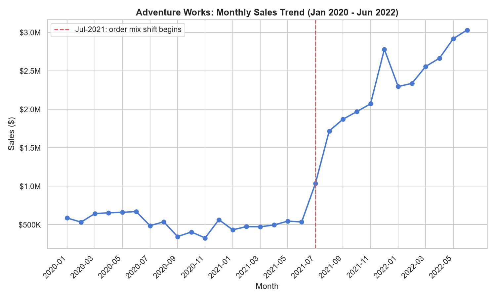
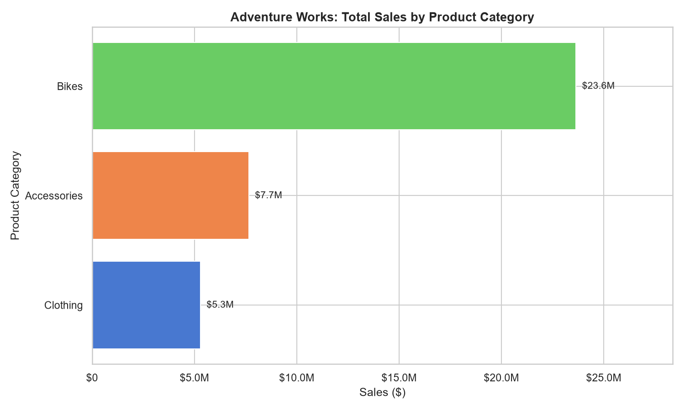
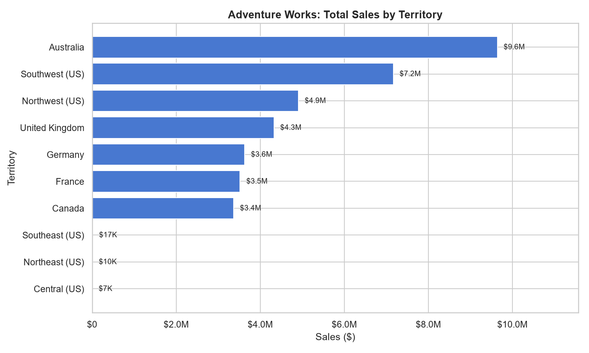
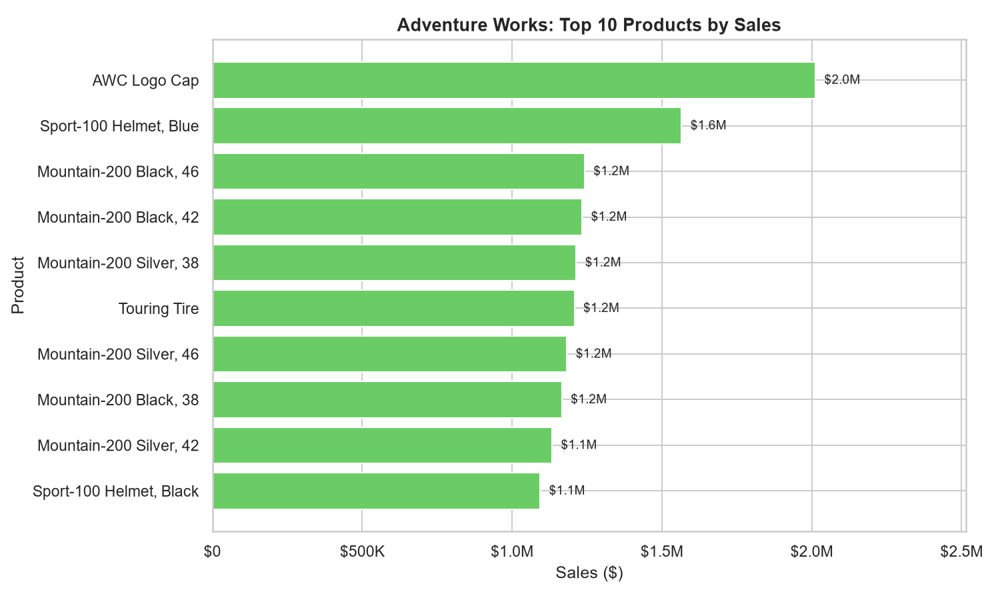
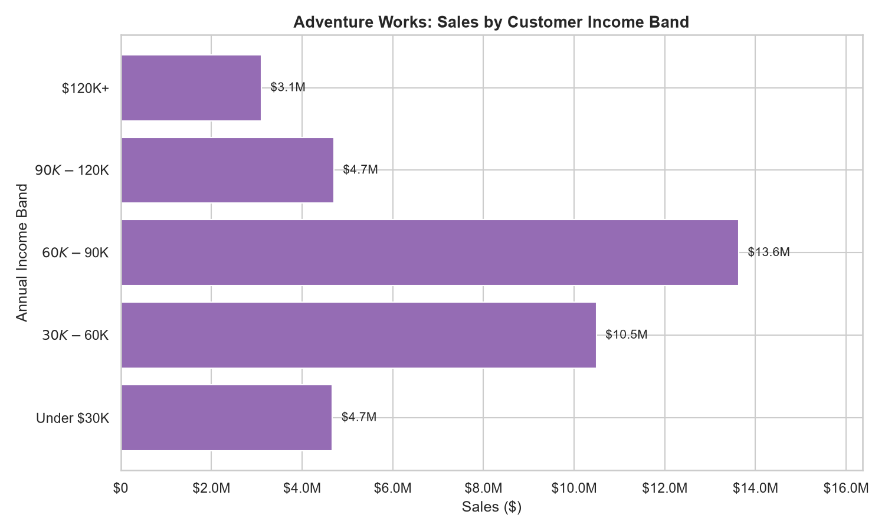
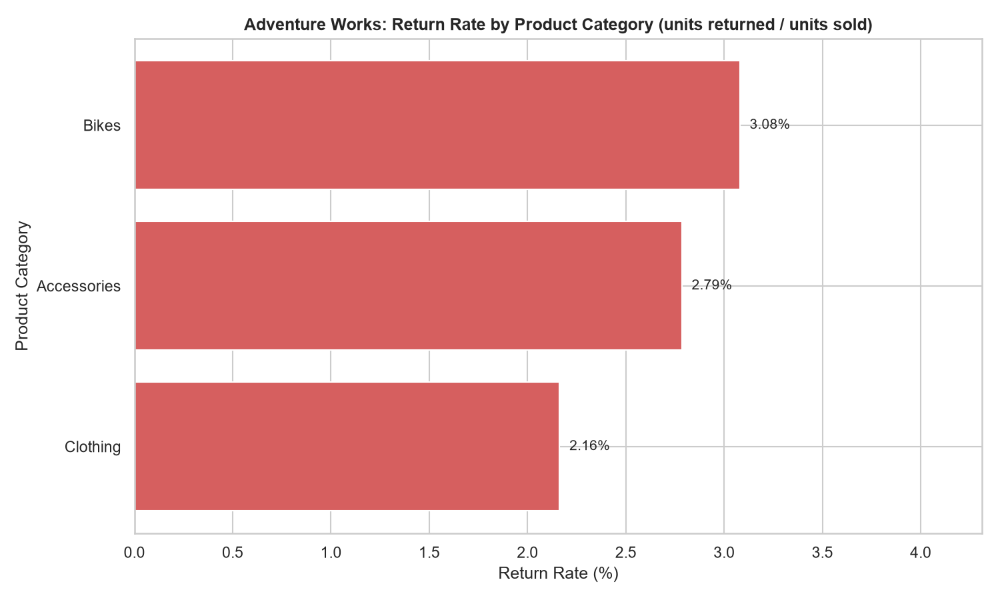

# Insight Report: Adventure Works Sales Performance

**Date:** 2026-07-22
**Database used:** ADVENTURE_WORKS.DATA (Snowflake, warehouse COMPUTE_WH)
**Based on:** `eda_adventure_works.md` and `quality_adventure_works.md` (both dated 2026-07-22)

## Executive Summary

Across 2020-01-01 through 2022-06-30, Adventure Works generated **$36.6M in total sales** from **25,164 orders** and **17,416 unique customers** (average order value $1,454). Sales grew roughly **5x from an ~$530K/month baseline (2020–mid-2021) to over $3.0M/month by June 2022**, driven almost entirely by a structural shift in order composition beginning July 2021, not by organic per-order growth. Bikes is by far the dominant category ($23.6M, 65% of sales), Australia and the two US "coastal" regions carry the bulk of geographic revenue, and product-level demand is heavily concentrated in a handful of SKUs (Mountain-200 bike variants and the AWC Logo Cap).

## Key Findings

1. **Total sales: $36.6M** across 25,164 orders, 84,174 units, and 17,416 distinct customers (2020-01-01 to 2022-06-30).
2. **Sales grew ~5x, but the growth is a mix-shift, not organic per-order growth.** Before July 2021, every order averaged exactly 1 line item and $2,158 AOV. From July 2021 onward, orders average 2.48 line items and $1,308 AOV — more, smaller-basket orders replaced fewer, larger-basket orders. See Risks below — this is a data-pattern finding, not a confirmed business event.
3. **Bikes drives 65% of revenue** ($23.6M) from just 13,929 units — the highest revenue-per-unit category by far — while Accessories drives most unit volume (57,809 units, 69% of all units sold) but only 21% of revenue ($7.7M).
4. **Geographic concentration:** Australia ($9.6M), Southwest US ($7.2M), and Northwest US ($4.9M) together account for 60% of total sales. Three US regions (Southeast, Northeast, Central) combined contribute only $34K (0.09% of sales) — a near-zero footprint worth flagging to the business.
5. **Top 10 products account for $12.0M (33%) of total sales**, led by the AWC Logo Cap ($2.0M) and Sport-100 Helmet, Blue ($1.6M) — both accessory items outselling most individual bike SKUs in dollar terms despite far lower unit price.
6. **Mid-income customers ($60K–$90K) are the largest revenue segment**, contributing $13.6M (37% of sales) from 6,422 customers — more than double the $120K+ band's $3.1M, despite the affluent band presumably having more discretionary spend per capita.
7. **Return rates are low and roughly consistent across categories:** Bikes 3.08% (429/13,929 units), Accessories 2.78% (1,610/57,809 units), Clothing 2.16% (269/12,436 units). No category stands out as a quality outlier.

## Supporting Evidence

### Monthly Sales Trend

| Period | Orders | Line Items | Units | Lines/Order | Avg Order Value |
|---|---|---|---|---|---|
| Pre Jul-2021 | 4,336 | 4,336 | 4,336 | 1.00 | $2,158.16 |
| Jul-2021 onward | 20,828 | 51,710 | 79,838 | 2.48 | $1,307.83 |

Monthly sales held in a $330K–$670K band for 18 straight months (Jan 2020–Jun 2021), then jumped to $1.0M in July 2021 and climbed steadily to $3.0M by June 2022 — a sustained trend, not a one-month spike.

### Sales by Product Category

| Category | Sales | Units | Orders (containing category) |
|---|---|---|---|
| Bikes | $23,642,500 | 13,929 | 13,929 |
| Accessories | $7,660,886 | 57,809 | 16,983 |
| Clothing | $5,293,931 | 12,436 | 6,976 |

### Sales by Territory

| Region | Country | Sales |
|---|---|---|
| Australia | Australia | $9,641,943 |
| Southwest | United States | $7,165,986 |
| Northwest | United States | $4,909,143 |
| United Kingdom | United Kingdom | $4,326,355 |
| Germany | Germany | $3,630,846 |
| France | France | $3,520,447 |
| Canada | Canada | $3,368,605 |
| Southeast | United States | $16,938 |
| Northeast | United States | $10,321 |
| Central | United States | $6,733 |

### Top 10 Products by Sales

Led by AWC Logo Cap ($2.01M, 4,151 units) and Sport-100 Helmet, Blue ($1.57M, 1,995 units); five of the top 10 are Mountain-200 bike color/size variants.

### Sales by Customer Income Band

| Income Band | Customers | Orders | Sales |
|---|---|---|---|
| Under $30K | 2,775 | 3,632 | $4,669,907 |
| $30K–$60K | 5,343 | 7,474 | $10,492,187 |
| $60K–$90K | 6,422 | 9,408 | $13,630,776 |
| $90K–$120K | 1,786 | 2,904 | $4,702,098 |
| $120K+ | 1,090 | 1,746 | $3,102,348 |

### Sales by Occupation
| Occupation | Customers | Sales |
|---|---|---|
| Professional | 5,219 | $12,070,419 |
| Skilled Manual | 4,264 | $8,189,214 |
| Management | 2,909 | $6,567,289 |
| Clerical | 2,749 | $5,812,683 |
| Manual | 2,275 | $3,957,712 |

### Return Rate by Category

Return rate computed as `SUM(RETURN_QUANTITY) / SUM(ORDER_QUANTITY)` per category (FACT_RETURNS joined via PRODUCT_KEY → DIM_PRODUCT_SUBCATEGORY → DIM_PRODUCT_CATEGORY).

## Risks / Limitations

- **All figures use FACT_SALES_2020 alone**, per the documented data-quality finding that FACT_SALES_2021 and FACT_SALES_2022 are exact-duplicate subsets of FACT_SALES_2020 (see `quality_adventure_works.md`, Issue 1). Using all three tables via UNION ALL would have double/triple-counted ~28,664 order lines.
- **Revenue is derived, not stored.** FACT_SALES has no dollar column; sales = `ORDER_QUANTITY × DIM_PRODUCT.PRODUCT_PRICE`, where PRODUCT_PRICE is a current/point-in-time list price with no history. If prices changed between 2020 and 2022, historical revenue here will not exactly match true point-of-sale revenue.
- **The July 2021 shift from 1 line-item/order to 2.48 line-items/order is a pattern observed in the data, not a confirmed business cause.** It coincides exactly with the same date used as the "cutover" in the FACT_SALES table-overlap finding, so it may reflect a change in how source systems fed this table (e.g., a new order-capture system or a data-load boundary) rather than a genuine change in customer purchasing behavior. This should be confirmed with the data owner before being cited as a business trend (e.g., "customers began buying more per basket").
- **Returns cannot be tied to a specific order or customer** (FACT_RETURNS has no ORDER_NUMBER/CUSTOMER_KEY), so return rate here is at the product/category grain only — it cannot be broken out by region, income band, or customer segment.
- **DIM_PRODUCT_CATEGORY_SALES_PIVOT was excluded entirely**, consistent with the quality report's recommendation, since its date range (2022-07-01 to 2022-07-05) and region taxonomy (North/Central/South) don't reconcile with the rest of the model.
- **Customer segment sales (income band, occupation) are not cleaned for the 130 GENDER="NA" customers or the 38 customers with 100+ implied age** — none of the breakdowns used here are gender- or age-based, so this does not affect the figures reported, but any follow-on age/gender segmentation should apply those exclusions first.
- Territory sales are attributed at the order's territory grain; a territory likely represents shipping/customer location rather than warehouse origin — not independently verified in this pass.

## Recommendations

1. **Confirm the July 2021 order-pattern shift with the data owner** before using pre-/post-July 2021 trend comparisons in any external-facing report — determine whether it reflects a source-system change (most likely, given its alignment with the known table-overlap cutover) or an actual business change (e.g., a new sales channel or reseller program going live).
2. **Investigate the near-zero revenue in Southeast, Northeast, and Central US territories** ($34K combined vs. $7.2M for Southwest US alone) — this is either a market-development opportunity or a sign these territories are placeholder/inactive records; either way it warrants a business-side explanation before capacity or marketing decisions reference "10 territories" as equally active.
3. **Treat Accessories as a volume/traffic driver, not a margin driver** — it moves 69% of units but only 21% of revenue; consider whether accessory attach-rate (bundling with Bike purchases) is being tracked and could be grown, since Bikes customers are the highest-value segment.
4. **Prioritize retention/growth programs on the $60K–$90K income band and "Professional" occupation segment**, which together represent the largest revenue concentration — validate whether current marketing spend is weighted toward this segment or skewed toward higher-income bands that in fact contribute less.
5. **Do not build a return-rate-by-region or return-rate-by-customer report** until FACT_RETURNS gains order/customer linkage — flag this as a data-capture gap to the source system owner if return analysis by customer segment becomes a stated business need.

## Appendices

### A. Metric Definitions Used (per Metrics Glossary — `metrics.md`)
- **Total Sales** = `SUM(ORDER_QUANTITY × PRODUCT_PRICE)`, joined FACT_SALES_2020 → DIM_PRODUCT on PRODUCT_KEY.
- **Order Count** = `COUNT(DISTINCT ORDER_NUMBER)`.
- **Average Order Value** = Total Sales ÷ Order Count.
- **Units Sold** = `SUM(ORDER_QUANTITY)`.
- **Customer Count** = `COUNT(DISTINCT CUSTOMER_KEY)`.
- **Return Rate** = `SUM(RETURN_QUANTITY) ÷ SUM(ORDER_QUANTITY)` at the product-category grain (finest grain FACT_RETURNS supports).

### B. Source Queries
All figures were computed live against `ADVENTURE_WORKS.DATA` via the `snowflake_AW` MCP connection on 2026-07-22, joining `FACT_SALES_2020` to `DIM_PRODUCT`, `DIM_PRODUCT_SUBCATEGORY`, `DIM_PRODUCT_CATEGORY`, `DIM_TERRITORY`, and `DIM_CUSTOMER` as needed per section above. `FACT_RETURNS` was joined to the same product hierarchy for the return-rate calculation.

### C. Charts Produced
- `chart_monthly_sales_trend.png`
- `chart_sales_by_category.png`
- `chart_sales_by_territory.png`
- `chart_top_products.png`
- `chart_sales_by_income_band.png`
- `chart_return_rate_by_category.png`

## Key Takeaways

- Total sales of $36.6M (25,164 orders, 17,416 customers) over 2.5 years, using FACT_SALES_2020 as the sole authoritative source per the prior data-quality finding.
- Sales grew ~5x starting July 2021, but the growth is explained by a shift from single-line-item orders (pre-Jul 2021) to multi-item baskets (2.48 lines/order after) — likely a source-system change, needs owner confirmation before being called a business trend.
- Bikes = 65% of revenue from 17% of units; Accessories = 69% of units but only 21% of revenue — two very different roles in the portfolio.
- Australia, Southwest US, and Northwest US supply 60% of sales; three US territories combined supply under 0.1% — worth a direct business explanation.
- Return rates are low (2.2%–3.1%) and consistent across categories; no category-level quality red flag.