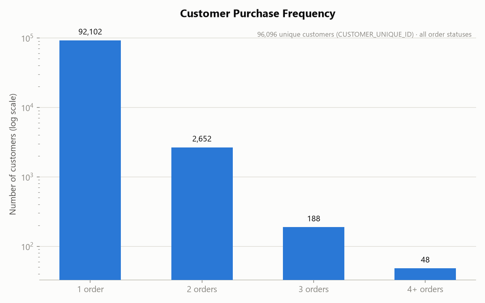
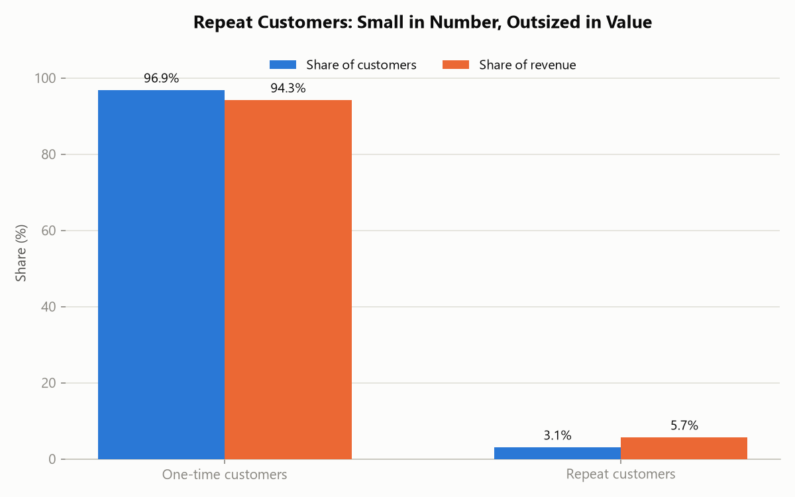
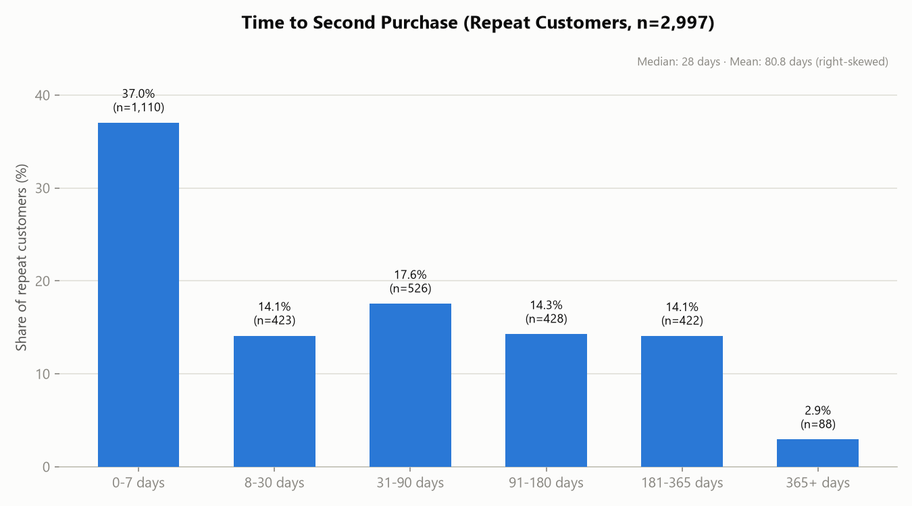

# Insight Report: Customer Purchase Behavior

**Date:** 2026-07-23
**Database:** OLIST_ECOMMERCE.RAW_DATA (Snowflake, warehouse COMPUTE_WH)
**Based on:** `eda_olist_ecommerce.md`, `quality_olist_ecommerce.md`, `cleaned_data_log.md` (2026-07-22), plus new queries run live for this report (2026-07-23)

## Executive Summary

Olist's business is **overwhelmingly single-purchase**: of 96,096 unique customers (by `CUSTOMER_UNIQUE_ID`), only **2,997 (3.1%) ever place a second order**. But those repeat customers are disproportionately valuable — they're 3.1% of the customer base yet generate **5.7% of total revenue** (R$778,821.97 of R$13,591,643.70), spending **R$259.87 per customer on average vs. R$137.63 for one-time buyers, an 89% premium**. When repeat customers do come back, they come back fast: the median gap between a customer's first and second order is just **28 days**, and 37% return within a week. Satisfaction is not what separates the two groups — one-time and repeat customers report almost identical average review scores (4.08 vs. 4.11) — so the retention gap looks like a demand/re-engagement problem, not a dissatisfaction problem.

## Key Findings

1. **Repeat purchase rate is 3.1%** — 2,997 of 96,096 unique customers placed more than one order; 93,099 (96.9%) are one-and-done. One customer placed 16 separate orders, the most of anyone.
2. **Repeat customers are worth ~1.9x more per capita.** Average revenue per repeat customer is R$259.87 vs. R$137.63 for one-time customers — despite being a small slice of the base, they contribute R$778,821.97 (5.7%) of the R$13,591,643.70 total product revenue.
3. **Return visits happen quickly when they happen at all.** Median time to second purchase is **28 days** (mean 80.8 days, right-skewed by a long tail up to 609 days). 37.0% of repeat customers reorder within a week, and 51.1% reorder within a month — suggesting a meaningful share of "repeat" activity is close-together multi-item shopping rather than a customer returning after a gap.
4. **Review scores do not explain the retention gap.** Average review score is 4.08 for one-time customers and 4.11 for repeat customers — a negligible 0.03-point difference. Satisfaction is uniformly high across both groups, so low overall retention is not primarily a product/delivery-quality story (see the existing `insights_executive_summary.md` finding that late delivery — not review score generally — is the dominant satisfaction driver).
5. **Repeat customers shop slightly wider, not dramatically wider.** They buy from an average of 1.57 distinct product categories vs. 0.99 for one-time customers — a modest increase, meaning most repeat customers are still concentrated in one or two categories rather than becoming broad basket-shoppers.
6. **Repeat customers rely more on installment credit**: average 3.27 payment installments vs. 2.89 for one-time customers, consistent with them placing more, and likely larger, credit-financed orders over time.
7. **Geographic variation in repeat rate is real but modest.** Among states with ≥500 customers, repeat rate ranges from 1.68% (Ceará) to 3.40% (Rio de Janeiro) — a 1.7-point spread. São Paulo, despite dominating revenue (38.3%, per the executive summary), has an unremarkable 3.22% repeat rate — its scale, not customer loyalty, drives its revenue share.

## Supporting Evidence

### Purchase Frequency Distribution

| Orders placed | Customers |
|---|---|
| 1 | 92,102 |
| 2 | 2,652 |
| 3 | 188 |
| 4+ | 48 |

(Sums to 94,990 customers with at least one non-canceled/unavailable order; the headline 96,096/2,997 figures below use all orders regardless of status, matching the quality report's established convention.)

### Revenue Concentration: One-time vs. Repeat

| Segment | Customers | Share of Customers | Total Revenue | Share of Revenue | Avg. Revenue / Customer |
|---|---|---|---|---|---|
| One-time | 93,099 | 96.88% | R$12,812,821.73 | 94.27% | R$137.63 |
| Repeat | 2,997 | 3.12% | R$778,821.97 | 5.73% | R$259.87 |

### Time to Second Purchase

| Days to second order | Customers | Share |
|---|---|---|
| 0–7 days | 1,110 | 37.0% |
| 8–30 days | 423 | 14.1% |
| 31–90 days | 526 | 17.6% |
| 91–180 days | 428 | 14.3% |
| 181–365 days | 422 | 14.1% |
| 365+ days | 88 | 2.9% |

Median: 28 days · Mean: 80.8 days · Range: 0–609 days.

### Behavioral Comparison: One-time vs. Repeat Customers

| Metric | One-time | Repeat |
|---|---|---|
| Avg. review score | 4.08 | 4.11 |
| Avg. payment installments | 2.89 | 3.27 |
| Avg. distinct categories purchased | 0.99 | 1.57 |

### Repeat Rate by State (states with ≥500 customers)

| State | Total Customers | Repeat Customers | Repeat Rate |
|---|---|---|---|
| RJ | 12,380 | 421 | 3.40% |
| MT | 876 | 29 | 3.31% |
| GO | 1,950 | 64 | 3.28% |
| SP | 40,302 | 1,297 | 3.22% |
| RS | 5,276 | 167 | 3.17% |
| MG | 11,251 | 338 | 3.00% |
| ... | ... | ... | ... |
| CE | 1,312 | 22 | 1.68% |

Full 17-state breakdown available on request; low-to-high spread is 1.68%–3.40%.

## Risks / Limitations

- **Repeat-purchase definition uses `CUSTOMER_UNIQUE_ID` with no time-window cap** — a customer who ordered once in 2016 and once in 2018 counts as "repeat" the same as one who ordered twice in a week. The time-to-second-purchase breakdown above is intended to give visibility into that mix, but the headline 3.1% figure does not distinguish "loyal returning customer" from "two nearly-simultaneous orders."
- **Revenue figures are Gross Merchandise Value** (all orders with line items, including later-canceled ones), consistent with the existing executive summary's convention — not recognized/net revenue.
- **Review-score comparison uses the cleaned, one-row-per-order REVIEWS table** (per `cleaned_data_log.md`); customers without any review are excluded from that specific average (92,392 one-time / 2,988 repeat customers had a scorable review).
- **Category diversity is measured via raw `PRODUCT_CATEGORY_NAME`**, not the cleaned/bucketed version — the 610 null-category and 13 unmatched-translation products (see quality report) are counted as their own "category" value in this specific metric, a minor undercount risk on the diversity figure only.
- State-level repeat rates are based on small counts in several states (e.g., CE n=1,312) — treat the low end of the range as directional, not a precise ranking.

## Recommendations

1. **Build a re-engagement trigger around the 28-day median return window.** Since half of repeat customers reorder within a month, a follow-up email/promotion timed at ~3–4 weeks post-purchase is well-aligned with existing natural behavior rather than fighting it — likely higher-converting than a generic "come back" campaign with no timing anchor.
2. **Don't treat review score as a retention lever on its own.** With almost no score gap between one-time and repeat customers (4.08 vs. 4.11), a "just improve satisfaction" retention strategy is unlikely to move the repeat-purchase needle much further beyond what the existing delivery-reliability recommendation already targets (per `insights_executive_summary.md`).
3. **Treat the 2,997 repeat customers as a high-value segment worth a dedicated program** (e.g., loyalty perks, early access) — they already spend ~1.9x more per capita; a modest increase in this segment's size would have outsized revenue impact relative to acquiring new one-time customers.
4. **Investigate cross-category prompts at checkout.** Repeat customers average only 1.57 categories — encouraging a second-category purchase on a customer's first order (the point where they're already converting) may be a lower-friction path to a second order than waiting for organic return.
5. **Do not over-index on state-level repeat-rate differences** (1.68%–3.40% spread) for regional strategy — the variation is real but small next to the timing and value findings above.

## Appendices

### A. Metric Definitions Used (per Metrics Glossary — `metrics.md`)
- **Customer** = `COUNT(DISTINCT CUSTOMER_UNIQUE_ID)`, joined from CUSTOMERS on CUSTOMER_ID → ORDERS, per the quality report's corrected definition.
- **One-time / Repeat segment** = customers with exactly 1 vs. more than 1 row in ORDERS (all statuses), grouped by CUSTOMER_UNIQUE_ID.
- **Revenue** = `SUM(ORDER_ITEMS.PRICE)` joined to ORDERS on ORDER_ID (product revenue only, freight excluded), consistent with `insights_executive_summary.md`.
- **Days to second purchase** = `DATEDIFF('day', first ORDER_PURCHASE_TIMESTAMP, second ORDER_PURCHASE_TIMESTAMP)` per CUSTOMER_UNIQUE_ID, ranked by ROW_NUMBER().
- **Avg. Review Score** = `AVG(REVIEW_SCORE)` on the cleaned, one-row-per-order REVIEWS table (dedup rule from `cleaned_data_log.md`).
- **Distinct categories** = `COUNT(DISTINCT PRODUCT_CATEGORY_NAME)` from PRODUCTS joined via ORDER_ITEMS, per customer.

### B. Source Queries
All figures computed live against `OLIST_ECOMMERCE.RAW_DATA` via the `snowflake_OR` MCP connection on 2026-07-23, joining CUSTOMERS, ORDERS, ORDER_ITEMS, PAYMENTS, PRODUCTS, and REVIEWS (with inline deduplication matching the cleaned-data logic). Revenue segmentation cross-checked against the total in `insights_executive_summary.md` (R$12,812,821.73 + R$778,821.97 = R$13,591,643.70 ✓).

### C. Charts Produced
- `chart_purchase_frequency_distribution.png`
- `chart_repeat_customer_revenue_share.png`
- `chart_days_to_second_purchase.png`

## Key Takeaways

- Only **3.1% of customers repeat**, but they generate **5.7% of revenue** at **1.9x the per-customer spend** of one-time buyers — a small, high-value segment worth targeting directly.
- When customers do return, they return **fast** (median 28 days) — retention programs should be timed around this window, not spread evenly over months.
- **Satisfaction is not the retention bottleneck** — review scores are nearly identical between segments (4.08 vs. 4.11) — so the fix is more likely re-engagement/marketing than product or delivery quality (delivery quality is already flagged as the top *satisfaction* lever elsewhere, but it doesn't explain the retention gap specifically).
- Repeat customers skew slightly more multi-category and installment-reliant, but not dramatically — most are still one- or two-category shoppers.
