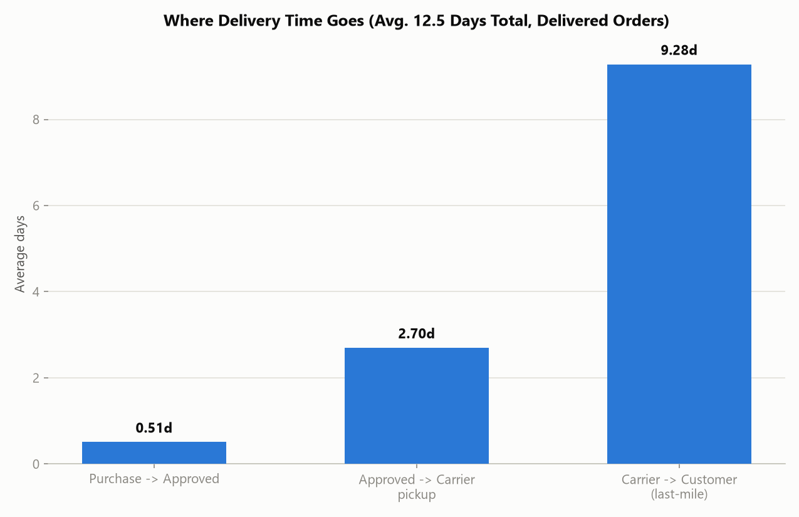

# Insight Report: Delivery and Logistics Performance

**Date:** 2026-07-23
**Database:** OLIST_ECOMMERCE.RAW_DATA (Snowflake, warehouse COMPUTE_WH)
**Based on:** `eda_olist_ecommerce.md`, `quality_olist_ecommerce.md`, `cleaned_data_log.md` (2026-07-22), plus new queries run live for this report (2026-07-23)

## Executive Summary

Average delivery takes **12.5 days from purchase** (median 10 days), and the **last-mile leg — carrier pickup to customer doorstep — consumes 9.28 of those 12.5 days (74%)**, dwarfing the seller-handling stages (0.51 days to approve, 2.70 days to carrier pickup). The platform-wide 8.1% late-delivery rate (from `insights_executive_summary.md`) hides **severe month-to-month volatility**: the late rate spiked to **21.36% in March 2018** — more than 2.5x the platform average — after climbing from 5.29% in October 2017. Geography compounds the problem: **cross-state shipments take nearly double the time of same-state shipments (15.0 vs. 7.9 days) and are 50% more likely to be late (9.0% vs. 6.0%)**, and the five worst-performing states (AL, MA, PI, CE, SE — all in Brazil's North/Northeast) see late rates of **15–24%**, two to three times the platform average. Root-cause analysis shows seller dispatch delay is a strong per-order risk multiplier (a late seller handoff nearly quadruples an order's chance of being late overall) but is infrequent enough (9.3% of items) that **most late deliveries are a carrier/last-mile problem, not a seller problem**.

## Key Findings

1. **The last-mile leg dominates delivery time**: of the 12.5-day average, 9.28 days (74%) is carrier-to-customer transit, vs. 0.51 days to approve the order and 2.70 days for the seller to hand off to the carrier. Any delivery-time improvement effort should target carrier/last-mile logistics, not order processing.
2. **Late-delivery rate is highly volatile month to month, not a stable 8.1% baseline.** It ranged from a low of 1.11% (October 2016, low-volume pilot month) to a high of **21.36% in March 2018** — a sustained climb from 5.29% in October 2017 through 14.31% (November 2017, likely Black Friday volume) to a peak in Feb–Mar 2018, before dropping sharply to 1.36% in June 2018. This is an operational capacity story, not a constant structural problem.
3. **Cross-state shipping is both slower and less reliable**: cross-state order-items average 15.0 days to deliver with a 9.0% late rate, vs. 7.9 days and 5.98% late for same-state shipments — nearly double the time and 50% higher late risk. Cross-state freight is also proportionally more expensive (18.3% of item price vs. 13.0% for same-state).
4. **Geography of lateness mirrors distance from the seller hub.** The five worst-performing customer states — Alagoas (23.93%), Maranhão (19.67%), Piauí (15.97%), Ceará (15.32%), and Sergipe (15.22%) — are all in Brazil's North/Northeast, far from São Paulo, the seller-concentration hub identified in `insights_seller_performance.md` (59.7% of sellers). By contrast, Paraná (5.00%), Minas Gerais (5.62%), and São Paulo itself (5.89%) have the lowest late rates.
5. **Seller dispatch delay is a strong per-order risk multiplier, but not the dominant volume driver.** 9.32% of order-items are handed to the carrier after the seller's own `SHIPPING_LIMIT_DATE` (a seller-caused dispatch delay). Of those late-handoff items, **24.09% result in a late final delivery — nearly 4x the 6.24% late-order rate for on-time-handoff items.** However, because late handoffs are relatively rare, they account for only an estimated ~28% of all late deliveries by volume; the remaining ~72% of late deliveries happen even when the seller ships on time, confirming the last-mile/carrier leg (Finding 1) as the primary structural bottleneck.
6. **Olist's delivery estimate is generously buffered on average** (11.88 days of slack between actual delivery and the estimated date), consistent with the executive summary's finding — but this average masks real variability: the worst states and months above show the buffer being consumed or exceeded entirely.

## Supporting Evidence

### Where Delivery Time Goes

| Stage | Avg. Days | Share of Total |
|---|---|---|
| Purchase → Approved | 0.51 | 4.1% |
| Approved → Carrier pickup | 2.70 | 21.6% |
| Carrier → Customer (last-mile) | 9.28 | 74.3% |
| **Total (Purchase → Delivered)** | **12.49** | **100%** |

(96,476 delivered orders; median total delivery time is 10 days, average 12.5 days — the distribution is right-skewed by slower outliers.)

### Monthly Late-Delivery Rate Trend

| Period | Late Rate | Note |
|---|---|---|
| 2016-10 | 1.11% | Low-volume pilot month (270 orders) |
| 2017-08 to 2017-10 | 3.3%–5.3% | Stable, below-average baseline |
| 2017-11 | 14.31% | Likely Black Friday volume surge |
| 2018-02 | 16.00% | Sustained elevated rate |
| **2018-03** | **21.36%** | **Peak — worst month in the dataset** |
| 2018-06 | 1.36% | Sharp recovery |
| 2018-08 | 10.39% | Rising again toward end of data window |

### Cross-State vs. Same-State Shipping

| Lane Type | Order-Items | Avg. Delivery Days | Late Rate | Avg. Freight | Freight % of Price |
|---|---|---|---|---|---|
| Same-state (seller & customer same state) | 39,863 | 7.9 | 5.98% | R$13.45 | 13.0% |
| Cross-state | 70,333 | 15.0 | 9.00% | R$23.63 | 18.3% |

### Late-Delivery Rate by Customer State (10 Worst)

| State | Delivered Orders | Avg. Delivery Days | Late Rate |
|---|---|---|---|
| AL | 397 | 24.5 | 23.93% |
| MA | 717 | 21.5 | 19.67% |
| PI | 476 | 19.4 | 15.97% |
| CE | 1,279 | 21.2 | 15.32% |
| SE | 335 | 21.5 | 15.22% |
| BA | 3,256 | 19.3 | 14.04% |
| RJ | 12,353 | 15.2 | 13.47% |
| PA | 946 | 23.7 | 12.37% |
| ES | 1,995 | 15.7 | 12.23% |
| MS | 701 | 15.5 | 11.55% |

Best-performing states (for reference): PR (5.00%), MG (5.62%), SP (5.89%) — all in the South/Southeast, near the seller hub.

### Seller Dispatch Delay vs. Final Delivery Outcome

| Metric | Value |
|---|---|
| Order-items shipped after seller's SHIPPING_LIMIT_DATE | 9.32% |
| Late-order rate when seller handoff was late | 24.09% |
| Late-order rate when seller handoff was on-time | 6.24% |
| Risk multiplier (late handoff vs. on-time handoff) | ~3.9x |

## Risks / Limitations

- **"Cross-state" is a proxy for shipping distance**, not actual geographic distance or logistics-network routing — two adjacent states are treated the same as two states on opposite sides of the country. Treat the same-state/cross-state split as directional, not a precise distance model.
- **Monthly late-rate figures for low-volume months (e.g., 2016-10, n=270) are less statistically stable** than high-volume months (e.g., 2018-03, n=7,003) — the March 2018 spike is based on a large sample and is reliable; earlier low-volume months carry more noise.
- **The seller-handoff analysis attributes lateness at the order-item level**; a multi-seller order's overall "late" status is shared across all sellers in that order regardless of which seller's item was actually late, consistent with the same limitation noted in `insights_seller_performance.md`.
- **No carrier identity or carrier-level breakdown exists in this dataset** — the "last-mile" finding (74% of delivery time) cannot be further attributed to a specific carrier or logistics partner; it is a structural stage-level finding only.
- **The Feb–Mar 2018 spike and the Nov 2017 spike are observed patterns, not diagnosed causes.** Plausible drivers (holiday volume surge, an external logistics disruption) are not confirmed by any field in this dataset and should be investigated with the operations team rather than assumed from this data alone.

## Recommendations

1. **Investigate what happened in February–March 2018 specifically.** A late rate of 21.36% (vs. an 8.1% platform average) affecting over 7,000 orders in March alone is the single largest logistics event in the dataset — identify whether this was a carrier capacity issue, a specific region/lane problem, or an external disruption, since fixing a one-time root cause could be higher-leverage than any general process change.
2. **Prioritize last-mile carrier performance over seller-side process improvements.** With 74% of delivery time and roughly 72% of late deliveries attributable to the carrier/last-mile leg even when sellers ship on time, carrier capacity/routing is the primary lever — a seller-only intervention (like the one recommended in `insights_seller_performance.md` for the 92 high-late-rate sellers) addresses a real but smaller share of the problem.
3. **Treat the Northeast/North states (AL, MA, PI, CE, SE) as a distinct logistics segment requiring dedicated attention** — their 15–24% late rates are 2–3x the platform average and likely reflect genuine last-mile network gaps far from the São Paulo seller hub, not a fixable seller-behavior issue.
4. **Still enforce on-time seller handoff, since it remains a strong individual-order risk factor** (3.9x more likely to be late) even though it's not the majority driver — this complements, rather than replaces, Recommendation 2.
5. **Consider a more conservative estimated-delivery-date buffer for cross-state and Northeast-state orders specifically**, rather than a uniform buffer platform-wide — since those lanes structurally take longer and are more variable, a segment-specific estimate would reduce false "late" flags and better set customer expectations.

## Appendices

### A. Metric Definitions Used (per Metrics Glossary — `metrics.md`)
- **Late Delivery** = `ORDER_DELIVERED_CUSTOMER_DATE > ORDER_ESTIMATED_DELIVERY_DATE`, restricted to orders with a non-null delivered date — consistent with `insights_executive_summary.md`.
- **Delivery Stage Duration** = `DATEDIFF('day', stage_start, stage_end)` averaged across all delivered orders, for each of: purchase→approved, approved→carrier, carrier→customer.
- **Cross-state / Same-state** = comparison of `SELLERS.SELLER_STATE` to `CUSTOMERS.CUSTOMER_STATE` for each order-item.
- **Seller Late Handoff** = `ORDER_ITEMS.SHIPPING_LIMIT_DATE < ORDERS.ORDER_DELIVERED_CARRIER_DATE` (seller handed the item to the carrier after their committed ship-by date).

### B. Source Queries
All figures computed live against `OLIST_ECOMMERCE.RAW_DATA` via the `snowflake_OR` MCP connection on 2026-07-23, joining ORDERS, ORDER_ITEMS, CUSTOMERS, and SELLERS. Overall late rate and delivery-time figures reconcile with `insights_executive_summary.md` (8.1% late rate, 12.5-day average delivery, 11.9-day average estimate buffer).

### C. Charts Produced
- `chart_delivery_stage_breakdown.png`
- `chart_monthly_late_rate_trend.png`
- `chart_late_rate_by_state.png`

## Key Takeaways

- **Last-mile transit (carrier → customer) is 74% of total delivery time** and the primary driver of most late deliveries — this is where operational investment should concentrate.
- **Late-delivery rate is highly volatile, peaking at 21.36% in March 2018** (vs. an 8.1% average) — a specific, investigable event rather than a constant baseline problem.
- **Northeast/North Brazil states (AL, MA, PI, CE, SE) are a distinct high-risk segment** at 15–24% late rates, 2–3x the platform average, tied to distance from the São Paulo seller hub.
- **Seller dispatch delay quadruples an individual order's late-delivery risk** (24.09% vs. 6.24%) but is infrequent (9.3% of items) — worth enforcing, but not a substitute for fixing last-mile carrier performance.
