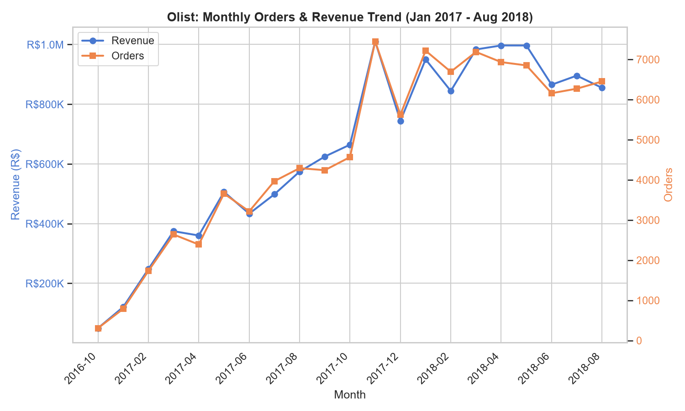
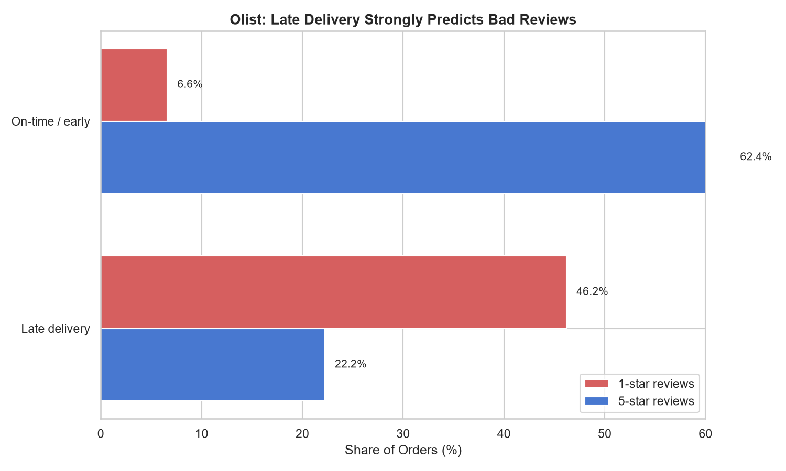
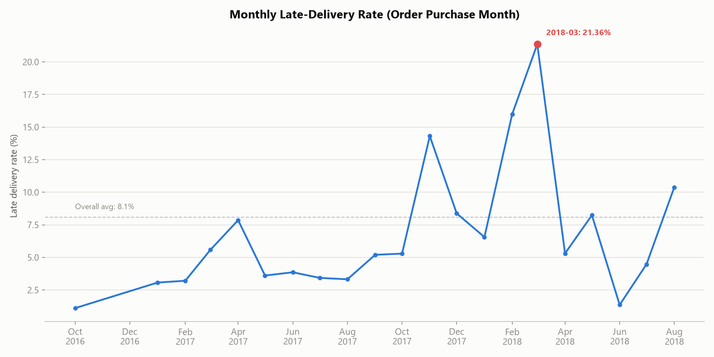
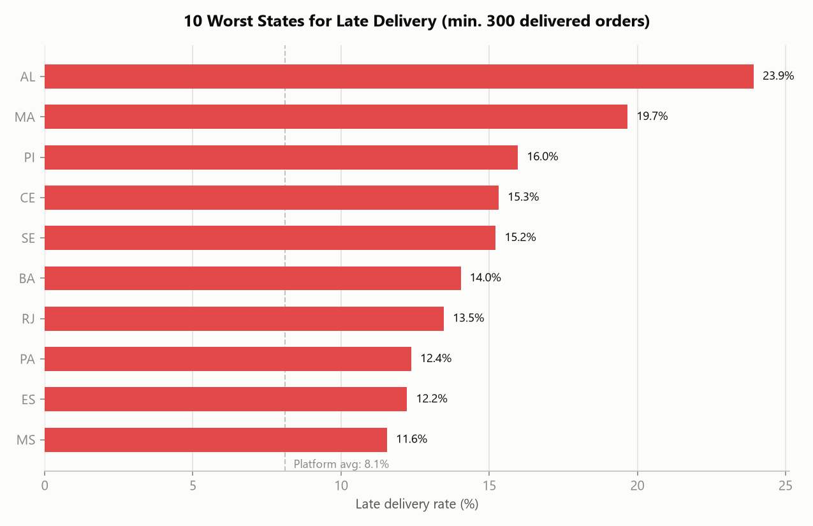
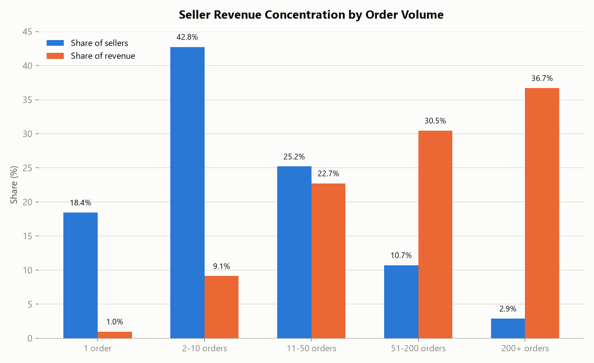
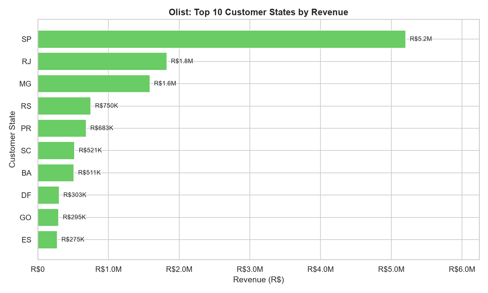
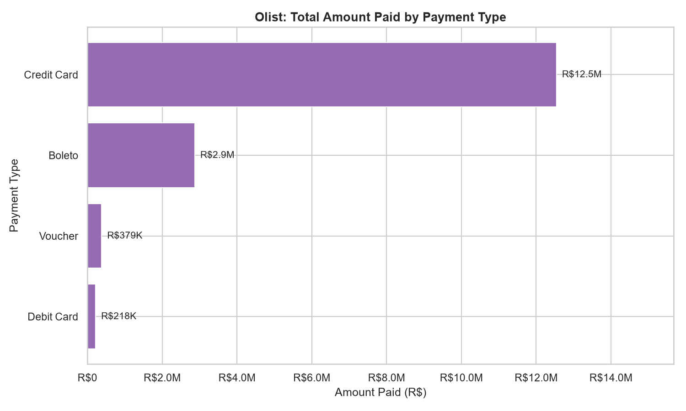

# Final Executive Report: Olist E-Commerce Performance

**Date:** 2026-07-23
**Database:** OLIST_ECOMMERCE.RAW_DATA (Snowflake, warehouse COMPUTE_WH)
**Synthesizes:** `eda_olist_ecommerce.md`, `quality_olist_ecommerce.md`, `cleaned_data_log.md` (2026-07-22, re-verified live 2026-07-23), `insights_executive_summary.md` (2026-07-22), and four deep-dive reports produced 2026-07-23: `insights_customer_purchase_behavior.md`, `insights_product_performance.md`, `insights_seller_performance.md`, `insights_delivery_logistics.md`

## Executive Summary

Olist generated **R$13,591,643.70 in product revenue** (+R$2,251,909.54 freight) from **99,441 orders and 96,096 unique customers** (via `CUSTOMER_UNIQUE_ID`) between October 2016 and August 2018, growing to a ~R$900K–1.0M/month run-rate before plateauing after November 2017. The business is structurally sound — no dead inventory, clean referential integrity, low cancellation (0.55%) — but has **two connected weak points that explain most of the headroom in the data**: (1) **retention is almost nonexistent** (only 3.1% of customers ever return, despite returning customers being worth 1.9x more), and (2) **delivery reliability is volatile and geographically uneven**, driving the strongest satisfaction effect in the dataset (late orders get 7x more 1-star reviews) and peaking at a **21.36% late rate in March 2018** — 2.6x the platform average. A third finding, **seller and revenue concentration in São Paulo**, compounds both: SP supplies 64.4% of seller-side revenue from just 59.7% of sellers, while the worst delivery performance is concentrated in the Northeast states farthest from that hub. Fixing delivery reliability and building a retention program are the two highest-leverage moves available; the data does not support prioritizing catalog changes or cancellation reduction.

## Key Findings

### 1. Business scale and trajectory
- **R$13.59M product revenue, 99,441 orders, 96,096 unique customers**, October 2016 – August 2018 (Appendix A for reconciliation notes on customer/order counts across reports).
- **Average order value: R$137.75** (product revenue only, orders with line items).
- Order volume grew through 2017, peaked at **7,451 orders in November 2017** (Black Friday effect), and **plateaued at 6,000–7,300 orders/month through mid-2018** — growth has leveled off, not continued climbing.
- **Cancellation rate is low (0.55%)** and not a material revenue leak.

### 2. Retention is the single largest untapped growth lever
- Only **2,997 of 96,096 customers (3.1%) ever place a second order.** The business is almost entirely acquisition-driven.
- Repeat customers are disproportionately valuable: **5.7% of revenue from 3.1% of customers**, spending **R$259.87 per customer on average vs. R$137.63 for one-time buyers — an 89% premium.**
- When customers do return, they return fast: **median 28 days** between first and second order; 37% return within a week.
- **Satisfaction does not explain the retention gap** — one-time and repeat customers report nearly identical review scores (4.08 vs. 4.11) — so a re-engagement/marketing push, timed around the 28-day window, is a more promising lever than a satisfaction fix specifically for retention.

### 3. Delivery reliability is the strongest driver of dissatisfaction, and it is volatile, not constant
- **Late deliveries (8.1% of orders) get 7x more 1-star reviews than on-time orders** (46.2% vs. 6.6%), and score 2.57 vs. 4.29 on average — the single strongest pattern in the entire dataset.
- The **8.1% average hides severe month-to-month volatility**: late rate climbed from 5.29% (Oct 2017) to a peak of **21.36% in March 2018**, then dropped to 1.36% by June 2018 — a specific, investigable operational event, not a stable baseline problem.
- **Last-mile transit (carrier → customer) consumes 74% of total delivery time** (9.28 of 12.5 average days) — order approval and seller dispatch are minor by comparison.
- **Cross-state shipments are nearly 2x slower and 50% more likely to be late** than same-state shipments (15.0 vs. 7.9 days; 9.0% vs. 6.0% late), and cost more in freight relative to price.
- **Northeast/North Brazil states (AL, MA, PI, CE, SE) see 15–24% late rates** — 2–3x the platform average — consistent with their distance from the São Paulo seller hub.

### 4. Seller base is concentrated and geographically skewed — more so than customers or products
- **17.6% of sellers generate 80% of revenue** (tighter concentration than the product side, where 25.9% of products = 80% of revenue). The top 89 sellers (200+ orders, 2.9% of sellers) alone hold **36.7% of revenue.**
- **São Paulo supplies 59.7% of sellers and 64.4% of seller-side revenue** — more concentrated than the customer-side SP revenue share (38.3%), meaning seller supply is even more geographically skewed than customer demand.
- **92 identifiable sellers with a ≥15% late-delivery rate score 0.41 points lower on average** (3.71 vs. 4.12) than reliable sellers — a small, targetable group.
- A handful of high-volume sellers have acute quality problems: **10 sellers with ≥30 orders each score below 3.1**, including one top-10-revenue seller (982 orders, 3.35 avg. score) flagged for immediate review.

### 5. Product catalog is healthy; one category needs targeted attention
- **Every one of the 32,951 products in the catalog has sold at least once** — no dead inventory.
- Revenue follows a genuine long tail: **25.9% of products generate 80% of revenue** — not a hits-driven business.
- Top categories: Health & Beauty (R$1.26M), Watches & Gifts (R$1.21M), Bed/Bath/Table (R$1.04M) — together 26% of revenue, with no single product exceeding 0.5% of total revenue.
- **office_furniture stands out as a combined problem**: the worst-rated category in the catalog (3.49 vs. 4.09 company average) **and** the most expensive to ship relative to price (25.0% freight ratio) — a strong signal of shipping/damage issues on bulky items, not a product-quality issue per se.
- Books and luggage/accessories categories are the satisfaction benchmark (4.23–4.45 avg. score).

### 6. Payment behavior is credit/installment-dependent — a structural feature, not a problem
- **77.6% of order-payments use credit card (91.9% of amount paid)**, averaging **3.51 installments** — a Brazil-market norm. Any checkout or payment-processing change should be confirmed with Finance given this dependency.

## Supporting Evidence

### Revenue and Order Trend

### Late Delivery Is the Strongest Driver of Poor Reviews

| Delivery Status | Orders | Avg. Score | 1-star share | 5-star share |
|---|---|---|---|---|
| Late | 7,662 | 2.57 | 46.2% | 22.2% |
| On-time / early | 88,168 | 4.29 | 6.6% | 62.4% |

### Late-Delivery Rate Is Volatile, Not Constant

Peak: **21.36% in March 2018** vs. an 8.1% overall average — the single largest logistics event in the dataset.

### Late-Delivery Rate Is Also Geographically Uneven

Worst: Alagoas (23.93%), Maranhão (19.67%), Piauí (15.97%) — all far from the São Paulo seller hub. Best: Paraná (5.00%), Minas Gerais (5.62%), São Paulo (5.89%).

### Repeat Customers Are Few But Disproportionately Valuable

| Segment | Customers | Share of Customers | Share of Revenue | Avg. Revenue / Customer |
|---|---|---|---|---|
| One-time | 93,099 | 96.88% | 94.27% | R$137.63 |
| Repeat | 2,997 | 3.12% | 5.73% | R$259.87 |

### Seller Revenue Concentration

200+ order sellers: 2.9% of sellers, 36.7% of revenue. 1-order sellers: 18.4% of sellers, just 1.0% of revenue.

### Category Performance: Revenue Leaders and Satisfaction Extremes

office_furniture: lowest review score (3.49) **and** highest freight-to-price ratio (25.0%) among major categories — the clearest combined product+logistics signal in the data.

### Revenue Concentration by Geography and Payment Type

SP: 38.3% of customer-side revenue. Credit card: 91.9% of amount paid, avg. 3.51 installments.

## Data Quality Actions Taken

Per `quality_olist_ecommerce.md` and `cleaned_data_log.md` (re-verified live against Snowflake on 2026-07-23 — all figures still match exactly):

- **REVIEWS deduplicated to one row per order** (kept latest `REVIEW_ANSWER_TIMESTAMP`), resolving 789 duplicate REVIEW_ID values and 547 multi-review orders. All review-score figures in this report and its source analyses use that cleaned grain.
- **CUSTOMER_UNIQUE_ID used throughout** for customer counts and repeat-purchase analysis, not the order-scoped CUSTOMER_ID (99,441 CUSTOMER_ID rows represent only 96,096 real people).
- **PRODUCTS category cleaned**: 610 null-category + 13 unmatched-translation products bucketed as "unknown_category" rather than dropped (1,627 line items, ~1.4% of revenue).
- **GEOLOCATION aggregated** to one row per zip prefix (19,005 rows, from 1,000,163; 10 further zips dropped on 2026-08-02 after a guardrails check found their averaged coordinates fell outside Brazil's territorial bounds — see `cleaned_data_log.md`) for any future geographic join — not needed for the analyses in this report, which used `CUSTOMER_STATE`/`SELLER_STATE` directly.
- No row-level defects were found in ORDERS, ORDER_ITEMS, SELLERS, or PAYMENTS (aside from 9 plausible R$0 voucher/not_defined payment rows) — these tables were left untouched.

## Risks / Limitations

- **Revenue figures are Gross Merchandise Value** (all orders with line items, including 542 later-canceled ones, ~0.5% overstatement) — not recognized/net revenue. Net this out if this report feeds a finance-facing reconciliation.
- **The late-delivery/review-score relationship, and the seller-late-rate/review-score relationship, are correlations**, not proven causal drivers — customers experiencing delays may also be reacting to co-occurring issues (packaging, seller communication).
- **The March 2018 logistics spike (21.36% late rate) is an observed pattern, not a diagnosed cause** — this dataset has no carrier identity or external-event field to confirm whether it was a capacity issue, a regional disruption, or something else. Investigate with the operations team.
- **Retention and revenue-segment figures use CUSTOMER_UNIQUE_ID with no time-window cap** — a customer who ordered once in 2016 and once in 2018 counts the same as one who ordered twice in a week.
- **The dataset ends abruptly in September 2018** (1 order) — almost certainly a data-extract cutoff; the "growth plateau" and "recovery after March 2018" narratives should be read as "last full months observed," not necessarily the business's trajectory beyond the extract date.
- Full caveats, sample-size thresholds, and methodology are documented in each underlying deep-dive report — this executive report summarizes their conclusions but does not repeat every limitation.

## Recommendations (Prioritized)

1. **Investigate the February–March 2018 logistics spike directly with operations.** A 21.36% late rate affecting over 7,000 March orders is the single largest identifiable event in the data — understanding and preventing a repeat is likely higher-leverage than any general process change.
2. **Build a delivery-reliability program focused on last-mile carrier performance**, especially for cross-state shipments and the Northeast/North states (AL, MA, PI, CE, SE) — these lanes are structurally 2–3x worse than the platform average and are not primarily a seller-behavior problem (74% of delivery time is the carrier leg, not seller dispatch).
3. **Launch a retention/re-engagement program timed around the 28-day median return window**, targeting the 93,099 one-time customers. This is the largest growth lever in the data: repeat customers are worth 1.9x more, and satisfaction is not the bottleneck (scores are nearly identical between segments), so marketing/re-engagement — not a satisfaction fix — is the right tool.
4. **Investigate office_furniture as a combined shipping/damage problem**, not a generic product-quality issue — it is simultaneously the worst-rated category and the most expensive to ship relative to price.
5. **Manage seller concentration as an operational risk.** Build dedicated account management for the top ~89 sellers (36.7% of revenue), enforce corrective action for the 92 high-late-rate sellers, and individually review the ~10 established sellers scoring below 3.1 (especially the 982-order seller at 3.35, a large revenue-at-risk account).
6. **Consider seller recruitment outside São Paulo** (e.g., RJ, MG) to reduce the supply-side geographic concentration (64.4% of seller revenue from SP) and potentially improve delivery times to nearby high-demand, currently-underserved regions.
7. **Confirm the credit-card/installment reliance (91.9% of amount paid, avg. 3.51 installments) with Finance** before any checkout or payment-processing change.
8. **Do not prioritize cancellation reduction (0.55%, immaterial) or catalog rationalization (zero dead SKUs, healthy long tail)** — the data does not support these as high-value initiatives relative to the six items above.

## Appendices

### A. Metric Definitions and Reconciliation Notes
All metric definitions follow `metrics.md` (Metrics Glossary) and are detailed in full in each source report's own Appendix A. One reconciliation note: the original `insights_executive_summary.md` (2026-07-22) reported "95,420 unique customers," counting only customers with at least one order that has line items; this report and the four 2026-07-23 deep-dives use **96,096**, the full unique-customer count across all orders regardless of item/status, per the quality report's canonical definition. The difference (676 customers) reflects orders that were canceled/unavailable before any line item was recorded — immaterial to any conclusion in this report.

### B. Source Reports
- `eda_olist_ecommerce.md` — full data profiling (2026-07-22)
- `quality_olist_ecommerce.md` — data quality findings and severity ranking (2026-07-22, re-verified live 2026-07-23)
- `cleaned_data_log.md` — cleaning methodology (2026-07-22, re-verified live 2026-07-23)
- `insights_executive_summary.md` — original executive analysis (2026-07-22)
- `insights_customer_purchase_behavior.md` — repeat purchase, retention timing, satisfaction-vs-retention (2026-07-23)
- `insights_product_performance.md` — category/product revenue, review scores, freight ratios (2026-07-23)
- `insights_seller_performance.md` — seller concentration, geography, quality outliers (2026-07-23)
- `insights_delivery_logistics.md` — delivery stage timing, monthly volatility, geographic lateness (2026-07-23)

### C. Charts Referenced (all previously generated, reused here — not regenerated)
- `chart_monthly_orders_revenue_trend.png`
- `chart_review_score_by_delivery_status.png`
- `chart_monthly_late_rate_trend.png`
- `chart_late_rate_by_state.png`
- `chart_repeat_customer_revenue_share.png`
- `chart_seller_revenue_concentration.png`
- `chart_top_categories_revenue.png`
- `chart_category_review_score_extremes.png`
- `chart_revenue_by_state.png`
- `chart_payment_type.png`

## Key Takeaways

- **R$13.59M revenue, 99,441 orders, 96,096 customers** (Oct 2016–Aug 2018); growth has plateaued since late 2017 and the data extract ends abruptly in Sept 2018.
- **Retention (3.1% repeat rate) is the top growth lever** — repeat customers are worth 1.9x more, return in a median of 28 days, and satisfaction is not what's holding them back.
- **Delivery reliability is the top satisfaction lever** — late orders get 7x more 1-star reviews, the late rate spiked to 21.36% in March 2018, and the Northeast states are structurally underserved relative to the São Paulo-centric seller base.
- **Seller and product concentration are healthy-to-monitor, not urgent fixes** — except for office_furniture (quality + shipping cost problem) and a small number of identifiable underperforming sellers, which are specific, addressable exceptions.
- **Data quality is solid post-cleaning**: two high-severity issues (REVIEW_ID duplication, CUSTOMER_ID vs. CUSTOMER_UNIQUE_ID) were identified and corrected; all findings in this report use the cleaned, corrected data.
