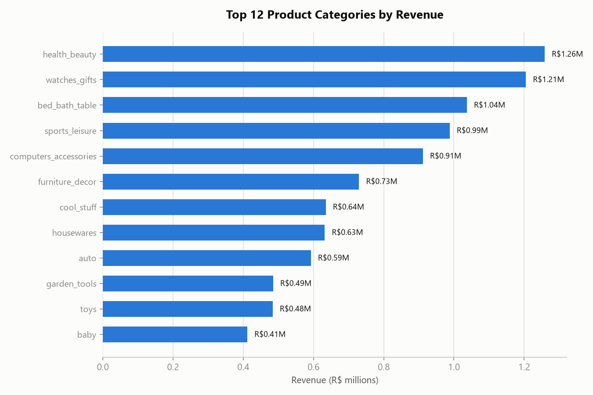
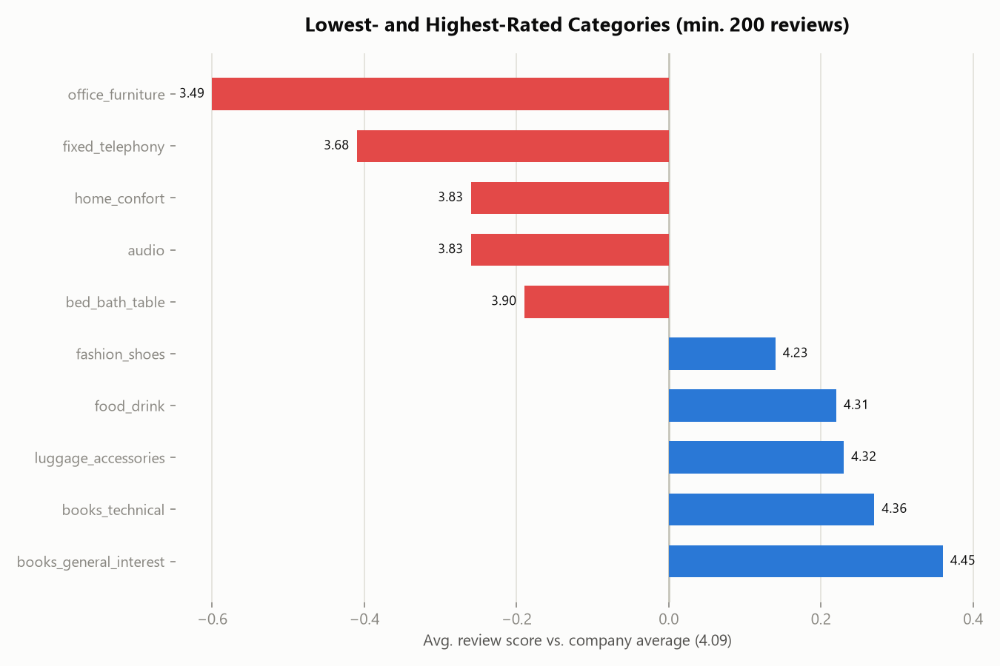

# Insight Report: Product Performance

**Date:** 2026-07-23
**Database:** OLIST_ECOMMERCE.RAW_DATA (Snowflake, warehouse COMPUTE_WH)
**Based on:** `eda_olist_ecommerce.md`, `quality_olist_ecommerce.md`, `cleaned_data_log.md` (2026-07-22), plus new queries run live for this report (2026-07-23)

## Executive Summary

Olist's R$13.6M in product revenue is spread across a genuinely broad catalog: **all 32,951 products in the catalog have sold at least once** (zero dead SKUs), and it takes **25.9% of the catalog (8,536 products) to reach 80% of revenue** — a long tail, not a hits-driven business. **Health & Beauty, Watches & Gifts, and Bed/Bath/Table are the top 3 categories**, together contributing R$3.5M (26% of revenue). The most actionable finding is on the satisfaction side: **office_furniture is the worst-rated category in the catalog (3.49 avg. score, 0.60 points below the company average)**, and three other categories — fixed_telephony, home_confort, and audio — also sit meaningfully below average, while **books and luggage/accessories categories are the most satisfying purchases** (4.23–4.45). Freight cost also varies sharply by category, from 8.3% of item price (watches_gifts) to 25.0% (office_furniture) — the worst-rated category is also the most expensive to ship relative to its price.

## Key Findings

1. **No dead inventory**: all 32,951 products in the PRODUCTS table have at least one recorded sale in ORDER_ITEMS — every SKU that exists has moved.
2. **Revenue has a long tail, not a hit-driven concentration**: it takes **8,536 products (25.9% of the 32,951-product catalog)** to reach 80% of total revenue. This is meaningfully more distributed than a classic 80/20 split, meaning no small cluster of "hero SKUs" is propping up the business.
3. **Top single product generated R$63,885** (195 units, Health & Beauty) — the single largest revenue product is still under 0.5% of total revenue, reinforcing the long-tail finding above.
4. **Category revenue leaders**: Health & Beauty (R$1.26M), Watches & Gifts (R$1.21M), and Bed/Bath/Table (R$1.04M) are the top 3, together 26% of total revenue. The top 12 categories span R$412K–R$1.26M each — a gradual drop-off, not a cliff.
5. **office_furniture is the standout satisfaction problem**: 3.49 average review score vs. a 4.09 company average (0.60 points below, min. 200 reviews) — the single worst-performing category in the catalog. fixed_telephony (3.68), home_confort (3.83), and audio (3.83) are also notably below average.
6. **Books and travel/luggage categories are the most satisfying purchases**: books_general_interest (4.45), books_technical (4.36), luggage_accessories (4.32), food_drink (4.31), and fashion_shoes (4.23) all outperform the company average.
7. **Freight cost as a share of item price varies nearly 3x across categories** — from 8.3% (watches_gifts, high-value/low-bulk items) to 25.0% (office_furniture) and 23.7% (furniture_decor). Notably, **office_furniture is both the worst-rated AND the most expensive-to-ship category**, a combination worth investigating together (see Recommendations).

## Supporting Evidence

### Top 12 Categories by Revenue

| Category | Distinct Products | Units Sold | Revenue | Avg. Price | Freight % of Price |
|---|---|---|---|---|---|
| health_beauty | 2,444 | 9,670 | R$1,258,681.34 | R$130.16 | 14.5% |
| watches_gifts | 1,329 | 5,991 | R$1,205,005.68 | R$201.14 | 8.3% |
| bed_bath_table | 3,029 | 11,115 | R$1,036,988.68 | R$93.30 | 19.7% |
| sports_leisure | 2,867 | 8,641 | R$988,048.97 | R$114.34 | 17.1% |
| computers_accessories | 1,639 | 7,827 | R$911,954.32 | R$116.51 | 16.2% |
| furniture_decor | 2,657 | 8,334 | R$729,762.49 | R$87.56 | 23.7% |
| cool_stuff | 789 | 3,796 | R$635,290.85 | R$167.36 | 13.2% |
| housewares | 2,335 | 6,964 | R$632,248.66 | R$90.79 | 23.1% |
| auto | 1,900 | 4,235 | R$592,720.11 | R$139.96 | 15.6% |
| garden_tools | 753 | 4,347 | R$485,256.46 | R$111.63 | 20.4% |
| toys | 1,411 | 4,117 | R$483,946.60 | R$117.55 | 16.0% |
| baby | 919 | 3,065 | R$411,764.89 | R$134.34 | 16.6% |

### Top 10 Products by Revenue

| Product ID | Category (raw) | Units Sold | Revenue |
|---|---|---|---|
| bb50f2e2...4686c | beleza_saude | 195 | R$63,885.00 |
| 6cdd5384...09f1595 | beleza_saude | 156 | R$54,730.20 |
| d6160fb7...30376af | pcs | 35 | R$48,899.34 |
| d1c42706...c61f2ac4 | informatica_acessorios | 343 | R$47,214.51 |
| 99a4788c...339b6058 | cama_mesa_banho | 488 | R$43,025.56 |
| 3dd2a171...c1e95ad7 | informatica_acessorios | 274 | R$41,082.60 |
| 25c38557...e339b6058* | bebes | 38 | R$38,907.32 |
| 5f504b3a...eb05bdc9 | cool_stuff | 63 | R$37,733.90 |
| 53b36df6...d6772e08 | relogios_presentes | 323 | R$37,683.42 |
| aca2eb7d...314663af | moveis_decoracao | 527 | R$37,608.90 |

*Category names shown as raw `PRODUCT_CATEGORY_NAME` (Portuguese); see category table above for English equivalents where applicable.

### Revenue Concentration (Pareto)
**8,536 of 32,951 products (25.9% of catalog) generate 80% of total product revenue.** All 32,951 products have at least one sale — there is no unsold/dead stock in this dataset.

### Category Review Score Extremes (min. 200 reviews per category)

| Category | Line Items | Avg. Review Score | vs. Company Avg (4.09) |
|---|---|---|---|
| office_furniture | 1,677 | 3.49 | −0.60 |
| fixed_telephony | 261 | 3.68 | −0.41 |
| home_confort | 432 | 3.83 | −0.26 |
| audio | 360 | 3.83 | −0.26 |
| bed_bath_table | 10,982 | 3.90 | −0.19 |
| fashion_shoes | 258 | 4.23 | +0.14 |
| food_drink | 277 | 4.31 | +0.22 |
| luggage_accessories | 1,088 | 4.32 | +0.23 |
| books_technical | 264 | 4.36 | +0.27 |
| books_general_interest | 549 | 4.45 | +0.36 |

## Risks / Limitations

- **Category revenue and review-score figures use `PRODUCT_CATEGORY_NAME_ENGLISH`** where available; the 610 null-category and 13 unmatched-translation products (per `quality_olist_ecommerce.md`) are bucketed as `unknown_category` (1,613 line items, avg. score 3.83) rather than dropped — this bucket is excluded from the "top categories" ranking above since it isn't a real category, but is included in total revenue and review-score population figures.
- **Review scores use the cleaned, one-row-per-order REVIEWS table** (dedup rule from `cleaned_data_log.md`); a product's review score is really an order-level score attributed to every line item in that order, so multi-item orders spread one review across several products — this is a modeling simplification common to this dataset, not unique to this report.
- **"80% of revenue from 25.9% of products" is a snapshot of the full Oct 2016–Aug 2018 window**, not a current run-rate — a product's cumulative lifetime revenue does not indicate whether it is still an active seller today.
- **The freight % of price figures are averages across all orders for a category**, not adjusted for the 4 zero/negative-weight products flagged in the quality report (0.01% of catalog, immaterial at this aggregation level).
- **Low-rated categories are correlated with review score, not proven to be causally driven by product quality** — office_furniture and bed_bath_table's low scores may be influenced by delivery/logistics issues (large/bulky items), consistent with the executive summary's finding that late delivery is the strongest driver of bad reviews generally; this report does not isolate product-quality complaints from delivery complaints within the review text.

## Recommendations

1. **Investigate office_furniture as a combined product-quality and logistics problem.** It is simultaneously the worst-rated category (3.49) and the most expensive to ship relative to price (25.0% freight ratio) — this pairing suggests damage-in-transit or delivery friction on bulky furniture items may be driving the low score, not the product itself. A targeted review of this category's shipping/packaging process is the highest-leverage single action in this report.
2. **Do not prioritize catalog rationalization.** With 0 unsold products and 80% of revenue coming from a full quarter of the catalog (not a tiny hit-driven core), there's no evidence of dead SKUs to prune — the catalog breadth appears to be a strength, not bloat.
3. **Study what books/luggage categories are doing right.** These are the most-satisfying purchase categories (4.23–4.45) and also have below-average freight ratios (13.2%–20.4% range) — likely smaller, lighter, less damage-prone items. Consider whether packaging practices from these categories could transfer to bulky-goods categories like furniture and bed/bath/table.
4. **Use freight ratio as a category-level cost lever, not just a satisfaction one.** Categories like furniture_decor (23.7%), housewares (23.1%), and office_furniture (25.0%) carry high shipping cost relative to item price — worth a pricing or shipping-subsidy review independent of the satisfaction angle.
5. **No action needed on revenue concentration** — the long-tail pattern (25.9% of products for 80% of revenue) is healthy and should be preserved rather than "optimized" toward fewer, bigger SKUs.

## Appendices

### A. Metric Definitions Used (per Metrics Glossary — `metrics.md`)
- **Category Revenue** = `SUM(ORDER_ITEMS.PRICE)` joined to PRODUCTS → CATEGORY_TRANSLATION (COALESCE unmatched/null to `unknown_category`), consistent with `cleaned_data_log.md`'s category-cleaning method.
- **Freight % of Price** = `SUM(ORDER_ITEMS.FREIGHT_VALUE) / SUM(ORDER_ITEMS.PRICE)` per category.
- **Avg. Review Score (by category)** = `AVG(REVIEW_SCORE)` on the cleaned, one-row-per-order REVIEWS table, joined via ORDER_ITEMS → ORDERS, restricted to categories with ≥200 line items to avoid small-sample noise.
- **Revenue Concentration (Pareto)** = products ranked by lifetime revenue descending; cumulative revenue crossing 80% of total revenue determines the product count.
- **Never Sold** = PRODUCT_ID present in PRODUCTS with no matching row in ORDER_ITEMS.

### B. Source Queries
All figures computed live against `OLIST_ECOMMERCE.RAW_DATA` via the `snowflake_OR` MCP connection on 2026-07-23, joining PRODUCTS, CATEGORY_TRANSLATION, ORDER_ITEMS, ORDERS, and REVIEWS (with inline deduplication matching the cleaned-data logic). Total category revenue across the top 12 categories (R$9.67M) plus remaining categories reconciles with the R$13,591,643.70 total reported in `insights_executive_summary.md`.

### C. Charts Produced
- `chart_top_categories_revenue.png`
- `chart_category_review_score_extremes.png`

## Key Takeaways

- **No dead stock**: all 32,951 products have sold; revenue is a genuine long tail (25.9% of catalog = 80% of revenue), not a hits business.
- **office_furniture is the one category needing intervention** — worst review score (3.49) AND highest freight-to-price ratio (25.0%) — a likely shipping/damage issue worth a targeted operational fix.
- **Books and luggage/accessories are the satisfaction benchmark** (4.23–4.45 avg. score) — worth studying for transferable packaging/fulfillment practices.
- **Health & Beauty, Watches & Gifts, and Bed/Bath/Table lead revenue** (26% combined) but no single category or product dominates — the top single product is under 0.5% of total revenue.
