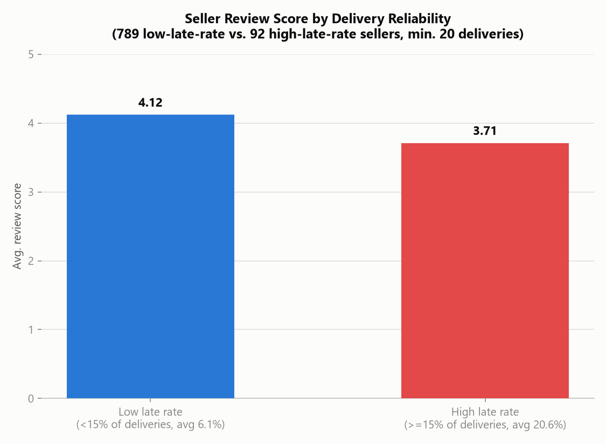

# Insight Report: Seller Performance

**Date:** 2026-07-23
**Database:** OLIST_ECOMMERCE.RAW_DATA (Snowflake, warehouse COMPUTE_WH)
**Based on:** `eda_olist_ecommerce.md`, `quality_olist_ecommerce.md`, `cleaned_data_log.md` (2026-07-22), plus new queries run live for this report (2026-07-23)

## Executive Summary

Seller performance on Olist is **highly concentrated and geographically lopsided**: just **89 sellers (2.9% of the 3,095-seller base) generate 36.7% of total revenue**, while the bottom 61% of sellers (2-10 orders each) contribute only 10% combined. **São Paulo alone accounts for 1,849 sellers (59.7%) and R$8.75M (64.4%) of seller-side revenue** — an even sharper concentration than the customer-side geographic finding in the executive summary. The clearest actionable pattern mirrors the customer-behavior finding: **sellers with a high late-delivery rate (≥15% of their deliveries) average a full 0.41-point-lower review score than reliable sellers (3.71 vs. 4.12)** — delivery reliability is a seller-level lever, not just a platform-wide one, and a small number of identifiable underperforming sellers are dragging down satisfaction.

## Key Findings

1. **Seller revenue is sharply concentrated**: it takes only **544 sellers (17.6% of the 3,095-seller base)** to reach 80% of total revenue — a much tighter concentration than the product-side finding (25.9% of products for 80% of revenue), meaning seller performance varies more than product performance.
2. **The top seller alone generated R$229,472.63** across 1,132 orders — 1.7% of total platform revenue from a single seller.
3. **Order-volume tiers show a steep power-law pattern**: 89 high-volume sellers (200+ orders, 2.9% of sellers) generate 36.7% of revenue, while 571 one-order sellers (18.4% of sellers) generate just 1.0% — a wide gap between the platform's core sellers and its long tail of occasional ones.
4. **Median seller revenue is R$821.48**, far below the R$4,391.48 average — confirming the distribution is heavily right-skewed by a small number of large sellers, not evenly spread.
5. **Delivery reliability is a strong seller-level driver of satisfaction**: sellers with a high late-delivery rate (≥15%, averaging 20.6% late) score **3.71 on average**, vs. **4.12** for sellers with a low late-delivery rate (<15%, averaging 6.1% late) — a 0.41-point gap on the same 1–5 scale, consistent with (and sharper than) the platform-wide late-delivery finding in `insights_executive_summary.md`.
6. **Seller base is extremely São Paulo-centric**: 1,849 of 3,095 sellers (59.7%) are based in SP, generating R$8.75M (64.4% of seller-attributed revenue) — more concentrated than the 38.3% customer-side SP revenue share reported in the executive summary, meaning SP is disproportionately a seller hub relative to its (already large) customer base.
7. **A small group of sellers has a clear, addressable quality problem**: among sellers with ≥30 orders, the 10 lowest-rated all score below 3.1 (worst: 2.20, on 114 orders) — these are established sellers with real order volume, not one-off flukes, and represent quantifiable "at-risk" accounts.

## Supporting Evidence

### Seller Revenue Concentration by Order Volume

| Order Volume Tier | Sellers | Share of Sellers | Bucket Revenue | Share of Revenue |
|---|---|---|---|---|
| 1 order | 571 | 18.4% | R$133,042.75 | 1.0% |
| 2–10 orders | 1,323 | 42.8% | R$1,239,115.51 | 9.1% |
| 11–50 orders | 780 | 25.2% | R$3,089,133.92 | 22.7% |
| 51–200 orders | 332 | 10.7% | R$4,140,562.97 | 30.5% |
| 200+ orders | 89 | 2.9% | R$4,989,788.55 | 36.7% |

### Seller Revenue Distribution Summary

| Metric | Value |
|---|---|
| Total sellers | 3,095 |
| Total revenue | R$13,591,643.70 |
| Average revenue per seller | R$4,391.48 |
| Median revenue per seller | R$821.48 |
| Minimum seller revenue | R$3.50 |
| Maximum seller revenue | R$229,472.63 |
| Sellers needed for 80% of revenue | 544 (17.6%) |

### Top 10 Sellers by Revenue

| Seller ID | State | Orders | Revenue | Avg. Review Score |
|---|---|---|---|---|
| 4869f7a5...4cdcae... | SP | 1,132 | R$229,472.63 | 4.12 |
| 53243585...53d8905 | BA | 358 | R$222,776.05 | 4.08 |
| 4a3ca931...61493884 | SP | 1,806 | R$200,472.92 | 3.80 |
| fa1c13f2...52fecda94 | SP | 585 | R$194,042.03 | 4.34 |
| 7c67e144...cea6b010ab | SP | 982 | R$187,923.89 | 3.35 |
| 7e93a43e...20bc753a | SP | 336 | R$176,431.87 | 4.21 |
| da8622b1...c5b9dab84a | SP | 1,314 | R$160,236.57 | 4.07 |
| 7a67c85e...2203ad736 | SP | 1,160 | R$141,745.53 | 4.24 |
| 1025f0e2...58b6550e0bfa | SP | 915 | R$138,968.55 | 3.85 |
| 955fee92...531780ce60 | SP | 1,287 | R$135,171.70 | 4.05 |

Note: 9 of the top 10 sellers by revenue are based in SP — even among top performers, geographic concentration holds. One top-10 seller (7c67e144...) shows a notably below-average score (3.35) despite high volume (982 orders) — worth individual investigation.

### Review Score by Seller Delivery Reliability

| Seller Group | Sellers | Avg. Late Rate | Avg. Review Score |
|---|---|---|---|
| Low late rate (<15% of deliveries) | 789 | 6.1% | 4.12 |
| High late rate (≥15% of deliveries) | 92 | 20.6% | 3.71 |

(Restricted to sellers with ≥20 delivered items to avoid small-sample noise; 92 sellers with a materially worse delivery track record are identifiable and addressable as a discrete group.)

### Seller Revenue by State (Top 8)

| State | Sellers | Revenue |
|---|---|---|
| SP | 1,849 | R$8,753,396.21 |
| PR | 349 | R$1,261,887.21 |
| MG | 244 | R$1,011,564.74 |
| RJ | 171 | R$843,984.22 |
| SC | 190 | R$632,426.07 |
| RS | 129 | R$378,559.54 |
| BA | 19 | R$285,561.56 |
| DF | 30 | R$97,749.48 |

### Lowest-Rated Sellers (≥30 orders, min-order threshold to exclude noise)

| Seller ID | Orders | Avg. Review Score | Revenue |
|---|---|---|---|
| 1ca7077d...4a02686a | 114 | 2.20 | R$13,191.57 |
| 2eb70248...59f71b244378 | 198 | 2.72 | R$41,182.94 |
| 602044f2...b35c2e21cb | 49 | 2.89 | R$3,671.66 |
| 54965bbe...90b0b8541f52 | 74 | 2.94 | R$10,416.60 |
| a49928bc...05e09a9b4ca5 | 98 | 2.95 | R$8,816.70 |
| 972d0f9c...812cf0bfa3ad3c4 | 79 | 2.96 | R$7,748.79 |
| 8e6d7754...c96d255ebda59eba | 85 | 2.98 | R$14,497.27 |
| 2a1348e9...5aaa619b1a3679d6b | 51 | 3.00 | R$2,613.10 |
| bbad7e51...a0897397ffdca1979 | 68 | 3.04 | R$4,442.32 |
| ad781527...a11eecd9dcad7c1 | 44 | 3.07 | R$6,899.57 |

## Risks / Limitations

- **Seller-level review score is attributed via order-item → order → cleaned review**, so a multi-seller order's single review score is credited to every seller who fulfilled part of that order — this is a modeling simplification inherent to the dataset (no per-seller review field exists), not unique to this report.
- **Late-delivery rate is computed at the order level and applied to every seller in that order**; a multi-seller order that arrives late is attributed as "late" to all sellers involved even if only one seller's portion caused the delay. This is a known limitation, not a proven per-seller causal attribution.
- **The high-late-rate vs. low-late-rate seller comparison is correlational**, consistent with the platform-wide finding in `insights_executive_summary.md` that late delivery drives lower reviews — this report does not isolate seller-specific fault (e.g., seller handling time via `SHIPPING_LIMIT_DATE`) from carrier or address-related delays.
- **Seller state is a single fixed field** (`SELLERS.SELLER_STATE`) with no time dimension — this reflects current registered location, not necessarily where every historical order shipped from.
- **The "lowest-rated sellers" list uses a ≥30-order threshold** to exclude statistical noise from very-low-volume sellers; sellers below that threshold may have equally poor experiences but aren't large enough samples to be confident about individually.

## Recommendations

1. **Prioritize the 92 identified high-late-rate sellers for a delivery-reliability intervention.** This is a small, identifiable group (3% of active sellers) with an average 20.6% late rate and a real, quantified satisfaction cost (0.41-point review-score gap) — a far more targeted lever than a platform-wide delivery initiative alone.
2. **Individually review the 10 lowest-rated sellers with meaningful volume (≥30 orders).** These aren't noise — a seller like the one scoring 2.20 across 114 orders represents a sustained, real customer-experience problem and a candidate for a corrective-action or offboarding conversation.
3. **Treat seller concentration (17.6% of sellers = 80% of revenue) as an operational risk to monitor, not necessarily fix.** The top 89 sellers (200+ orders) generating 36.7% of revenue means Olist's platform health is meaningfully tied to a small set of accounts — losing even a handful of them would be a material revenue event; consider a retention/account-management program for this tier.
4. **Investigate the São Paulo seller concentration (59.7% of sellers, 64.4% of revenue) alongside the existing customer-side SP concentration (38.3% of revenue, per the executive summary).** Seller supply is even more concentrated than customer demand in SP — this may represent an opportunity (or a gap) to recruit sellers in other high-demand states like RJ and MG, which have strong customer revenue but comparatively few local sellers (RJ: 171 sellers vs. 1,849 in SP).
5. **Flag the one top-10-revenue seller with a below-average score (7c67e144..., 3.35 avg. score on 982 orders) for immediate account review** — high volume combined with low satisfaction is the highest-revenue-at-risk combination in the data.

## Appendices

### A. Metric Definitions Used (per Metrics Glossary — `metrics.md`)
- **Seller Revenue** = `SUM(ORDER_ITEMS.PRICE)` grouped by `SELLER_ID`.
- **Seller Order Count** = `COUNT(DISTINCT ORDER_ITEMS.ORDER_ID)` per seller.
- **Seller Late Rate** = delivered order-items where `ORDER_DELIVERED_CUSTOMER_DATE > ORDER_ESTIMATED_DELIVERY_DATE`, divided by all delivered order-items for that seller, restricted to sellers with ≥20 delivered items.
- **Seller Avg. Review Score** = `AVG(REVIEW_SCORE)` on the cleaned, one-row-per-order REVIEWS table, joined via ORDER_ITEMS → ORDERS, restricted to sellers with ≥30 orders where noted.
- **Revenue Concentration (Pareto)** = sellers ranked by lifetime revenue descending; cumulative revenue crossing 80% of total revenue determines the seller count.

### B. Source Queries
All figures computed live against `OLIST_ECOMMERCE.RAW_DATA` via the `snowflake_OR` MCP connection on 2026-07-23, joining SELLERS, ORDER_ITEMS, ORDERS, and REVIEWS (with inline deduplication matching the cleaned-data logic). Total seller revenue (R$13,591,643.70) reconciles exactly with the total reported in `insights_executive_summary.md` and `insights_product_performance.md`.

### C. Charts Produced
- `chart_seller_revenue_concentration.png`
- `chart_seller_review_by_late_rate.png`

## Key Takeaways

- **Seller revenue is more concentrated than product revenue**: 17.6% of sellers generate 80% of revenue (vs. 25.9% of products) — the top 89 sellers (200+ orders) alone hold 36.7% of total revenue.
- **Delivery reliability is a seller-level, not just platform-level, lever**: 92 identifiable high-late-rate sellers average 0.41 points lower on review score (3.71 vs. 4.12) — a targeted, actionable intervention group.
- **São Paulo dominates seller supply even more than customer demand**: 59.7% of sellers and 64.4% of seller-side revenue vs. 38.3% of customer-side revenue — a supply-side concentration worth weighing against seller-recruitment strategy in other states.
- **A small number of high-volume, low-satisfaction sellers are quantifiable revenue-at-risk accounts** — 10 sellers with ≥30 orders each score below 3.1, and one top-10-revenue seller (982 orders, 3.35 avg. score) stands out as an immediate review candidate.
